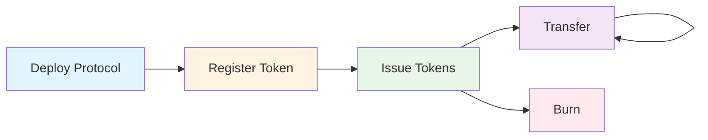
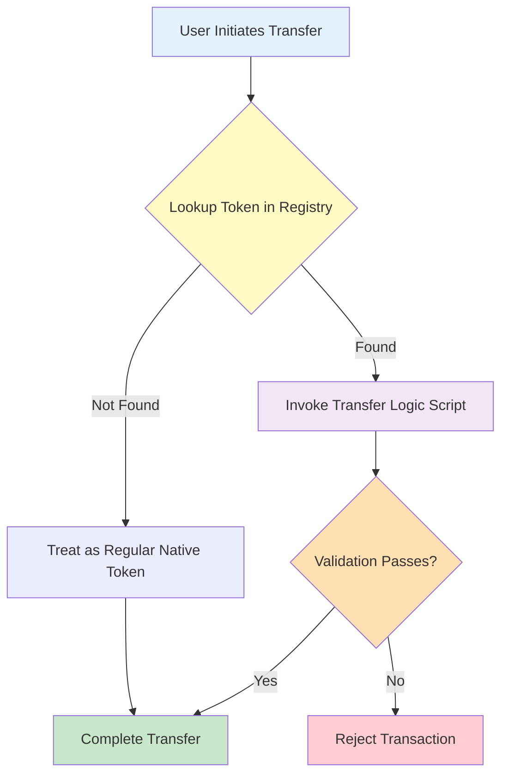

# CIP-113 Programmable Tokens — Aiken Implementation


**Smart contracts for CIP-113 programmable tokens on Cardano, written in Aiken.**

This repository contains the **on-chain** implementation. The off-chain platform (reference frontend, Java backend, and substandard implementations used for experimentation on testnets) lives in a companion repository:

👉 **[cardano-foundation/cip113-programmable-tokens-platform](https://github.com/cardano-foundation/cip113-programmable-tokens-platform)**

---

## Important Disclaimers

### Origins and Attribution

This implementation builds on the foundational **CIP-143 reference implementation** originally developed by Phil DiSarro and the IOG team. The Aiken validators in this repository are migrated from their Plutarch implementation.

**Original work:**
- Repository: [input-output-hk/wsc-poc](https://github.com/input-output-hk/wsc-poc)
- Specification: [CIP-143: Interoperable Programmable Tokens](https://cips.cardano.org/cip/CIP-0143)
- Authors: Phil DiSarro, IOG Team

We are deeply grateful for the significant effort and expertise invested in the original design and implementation. Their work has provided an invaluable foundation for advancing programmable token standards on Cardano.

### CIP-113 Adaptation

This codebase has been adapted to align with the requirements of **CIP-113**, which supersedes CIP-143 as a more comprehensive standard for programmable tokens on Cardano.

**Note:** CIP-113 ([PR #444](https://github.com/cardano-foundation/CIPs/pull/444)) has reached the CIP editors' **Last Check** stage — the final review window before the proposal is merged. Late changes are still possible until the merge, so this implementation reflects our current understanding and may require updates if the specification shifts during that window.

### Audit and Production Readiness

This codebase has been through a professional security audit; the findings from that review are resolved and the code is production-ready. CIP-113 itself has not yet been accepted as a Cardano Improvement Proposal — see the [CIP-113 pull request](https://github.com/cardano-foundation/CIPs/pull/444) for where the proposal stands.

---

## Overview

CIP-113 defines the core framework for programmable tokens on Cardano: the shared custody model, on-chain registry, and validation coordination. The actual rules that specific programmable tokens must obey (e.g. denylist checks, freeze-and-seize) are defined in **substandards** — pluggable rule sets that operate within the CIP-113 framework. This repository contains the core standard implementation; example substandards live in the [platform repository](https://github.com/cardano-foundation/cip113-programmable-tokens-platform/tree/main/src/substandards).

## What Are Programmable Tokens?

Programmable tokens are **native Cardano assets** with an additional layer of validation logic that executes on every transfer, mint, or burn operation. They leverage Cardano's existing native token infrastructure and require no hard fork or ledger changes — all programmable logic is implemented using features already supported at the L1 level. However, because all programmable tokens are held at a shared script address (with ownership determined by stake credentials), existing wallets, explorers, and DEXes would require integration work to fully support them — for example, wallets need to resolve stake-credential-based ownership to display balances, and DEX contracts would need to account for the programmable logic validators.

**Key principle:** All programmable tokens are locked in a shared smart contract address. Ownership is determined by stake credentials, allowing standard wallets to manage them while enabling unified validation across the entire token ecosystem.

## Key Features

- 🔐 **Permissioned Transfers** — Enforce custom validation rules on every token transfer
- 📋 **On-Chain Registry** — Decentralized directory of registered programmable tokens
- 🎯 **Composable Logic** — Plug-and-play transfer and minting validation scripts
- 🚫 **Freeze & Seize** — Optional issuer controls for regulatory compliance
- ⚡ **Direct-Index Registry Proofs** — A membership (or non-membership) proof is a direct index into the reference inputs, so cost scales with the proof's position, not the registry's size (`validators/third_party.ak:97`)
- 🔗 **Native Asset Based** — Built on Cardano's native token infrastructure with no hard fork required
- 🧹 **Unfracking** — Holder-driven UTxO restructuring that isolates each policy in its own UTxO, containing freeze collateral damage
- 🧩 **Extensible** — Support for denylists, allowlists, time-locks, and custom policies

## Use Cases

- **Stablecoins** — Fiat-backed tokens with sanctions screening and freeze capabilities
- **Tokenized Securities** — Compliance with securities regulations and transfer restrictions
- **Regulated Assets** — Any token requiring KYC/AML compliance or jurisdictional controls
- **Tokenized Real-World Assets (RWAs)** — Asset-backed tokens with programmable restrictions
- **Custom Policies** — Extensible framework for any programmable token logic

## Quick Start

### Prerequisites

- [Aiken](https://aiken-lang.org/installation-instructions) v1.1.23 (pinned in `aiken.toml`)
- [Cardano CLI](https://github.com/IntersectMBO/cardano-cli) (optional, for deployment)

### Build

```bash
aiken build
```

### Test

```bash
aiken check
```

`aiken check` must exit clean — see [Testing](#testing) below to scope a run or watch for changes.

## Project Structure

```
.
├── validators/                             # 12 validators, 34 blueprint entries incl. `.else` fallbacks
│   ├── programmable_logic_base.ak          # Token custody; reads the dispatcher credential, requires its withdraw-0
│   ├── programmable_logic_global.ak        # Dispatcher; requires the redeemer-named delegate's withdraw-0
│   ├── transfer.ak                         # Transfer delegate (the hot path)
│   ├── third_party.ak                      # Seize / clawback / freeze-enforcement delegate
│   ├── unfracking.ak                       # Holder-driven, same-owner restructuring delegate
│   ├── programmable_logic/                 # Invariant modules shared by the delegate validators
│   ├── registry.ak                         # Registry sorted linked list (mint + spend)
│   ├── issuance_mint.ak                    # Permanent per-token minting/burning policy
│   ├── issuance_logic.ak                   # Replaceable protocol-side issuance rules
│   ├── issuance_cbor_hex_mint.ak           # Issuance script template reference NFT (one-shot)
│   ├── protocol_params.ak                  # Protocol parameters NFT (one-shot mint + upgrade-path spend)
│   ├── upgrade_multisig.ak                 # Multisig-gated upgrade authority
│   └── always_fail.ak                      # Permanent lock for reference NFTs
├── lib/                                    # Shared library modules
│   ├── types.ak                            # Core datum and redeemer types
│   ├── registry_node.ak                    # Registry node datum shape and decoding
│   ├── linked_list.ak                      # Sorted linked list operations
│   ├── prog_assets.ak                      # PLB output-shape invariants
│   ├── multisig.ak                         # Multisig approval-tree evaluation
│   └── ...
├── env/                                    # Aiken environments (default, with_assertions)
├── documentation/                          # Architecture + integration guides
├── aiken.toml                              # Aiken project manifest
└── plutus.json                             # Generated blueprint (committed per release)
```

## Documentation

📚 **Documentation is available in the [`documentation/`](./documentation/) directory:**

- **[Introduction](./documentation/01-INTRODUCTION.md)** — Problem statement, concepts, and benefits
- **[Architecture](./documentation/02-ARCHITECTURE.md)** — System design, validator coordination, on-chain data structures, and validation flows
- **[Control Scope & Third-Party Actions](./documentation/03-CONTROL-SCOPE-AND-THIRD-PARTY-ACTIONS.md)** — What issuers can and cannot do: third-party action scope and registry lifecycle authority
- **[Developing Substandards](./documentation/09-DEVELOPING-SUBSTANDARDS.md)** — Guide for implementing new substandards (issuance, transfer, and third-party logic)
- **[Integration Guides](./documentation/08-INTEGRATION-GUIDES.md)** — For wallet developers, indexers, and dApp developers

## Core Components

The system is split into two layers: the **core standard** (CIP-113 framework, this repository) and **substandards** (pluggable token-specific rules, [platform repository](https://github.com/cardano-foundation/cip113-programmable-tokens-platform/tree/main/src/substandards)).

### Core Standard (CIP-113 Framework)

These components form the shared infrastructure that all programmable tokens use:

#### 1. Token Registry (On-Chain Directory)

A sorted linked list of registered programmable token policies, implemented as on-chain UTxOs with NFT markers (`lib/registry_node.ak:51-81`). Each registry entry (`RegistryNode`) carries the token's policy id (`key`), the substandard's minting, transfer, third-party (issuer control) and unfracking script credentials, and an optional global-state currency symbol. Covering-node proofs give membership and non-membership checks whose cost scales with the proof's position among the reference inputs, not with the size of the registry: a proof is a direct index into `reference_inputs` (`validators/third_party.ak:97`). Four of the seven fields are live configuration — the transfer, third-party and unfracking script credentials plus the global-state symbol can be updated in place by the token's lifecycle authority, its `minting_logic_script` credential (`validators/registry.ak:174-233`, `lib/linked_list.ak:180-207`); the key and that authority itself never change.

#### 2. Programmable Logic Base, Dispatcher, and Delegate Validators

A shared spending validator, `programmable_logic_base` (PLB), holds every programmable token (`validators/programmable_logic_base.ak:50`). PLB runs once per spent programmable input — the only per-input cost in the protocol — and does the smallest possible job: read one credential from the protocol-params datum, the `programmable_logic_global` dispatcher's, and require that credential's withdraw-zero at a witnessed index (`validators/programmable_logic_base.ak:72-74`). `programmable_logic_global` holds the three delegate script hashes as compile-time parameters and requires whichever one the redeemer names — `transfer` (ordinary transfers), `third_party` (seize / clawback / freeze enforcement) or `unfracking` (holder-driven, same-owner restructuring) — running once per transaction regardless of how many inputs it covers (`validators/programmable_logic_global.ak:48-70`).

#### 3. Minting Policies

- **Issuance** (`issuance_mint`, `issuance_logic`) — `issuance_mint` is permanent per token: its applied hash IS the token's policy id. It requires two withdraw-zeros: the substandard's own `minting_logic_cred` (which doubles as the token's **registry-lifecycle authority**) and the protocol's `issuance_logic`, named by the protocol-params datum's `issuance_logic_cred` field, proving it covered this policy id (`validators/issuance_mint.ak:34-64`). `issuance_logic` is the replaceable half — its rules can be upgraded for every existing token by rewriting one datum field, with no policy id moving (`validators/issuance_logic.ak:44-97`).
- **Registry Policy** (`registry`) — one script, two handlers: `mint` manages the sorted linked list of registered tokens, `spend` guards every node (`validators/registry.ak:49`, `:174`).
- **Protocol Params Policy** (`protocol_params`) — one-shot mint of the protocol-parameters NFT; `spend` enforces the three upgrade-path transaction shapes (`validators/protocol_params.ak:228`, `:276`).

#### 4. Upgrade Authority

`upgrade_multisig` holds the upgrade authority as a `MultisigScript` approval tree (Sundae's native-script ADT, `lib/multisig.ak`) inside a config UTxO it owns. `protocol_params` names this script's withdraw-zero credential as `upgrade_cred`; rotating signers is a config-UTxO update, not a script redeploy — the credential itself never moves (`validators/upgrade_multisig.ak:73-189`).

### Substandards (Pluggable Token Rules)

Substandards define the actual rules that specific programmable tokens must obey. They are stake validators invoked via 0-ADA withdrawals, registered in the on-chain registry, and executed by the core framework on every transfer. Different tokens can use different substandards depending on their compliance requirements.

Substandard implementations live in the platform repository:

- **[Dummy](https://github.com/cardano-foundation/cip113-programmable-tokens-platform/tree/main/src/substandards/dummy)** — Simple permissioned transfer requiring a specific credential
- **[Freeze and Seize](https://github.com/cardano-foundation/cip113-programmable-tokens-platform/tree/main/src/substandards/freeze-and-seize)** — Denylist-aware transfer logic, seizure/freeze operations, and on-chain denylist management for regulated stablecoins

### Validator Reference

**Core Standard (CIP-113 Framework)** — 12 validators, 34 `plutus.json` entries counting each validator's `.else` fallback.

| Validator | Handlers | Purpose |
|-----------|----------|---------|
| `programmable_logic_base` | Spend | Custody of every programmable-token UTxO; reads the dispatcher credential off the protocol-params datum and requires its withdraw-zero (`validators/programmable_logic_base.ak:50-77`) |
| `programmable_logic_global` | Withdraw, Publish | Dispatcher: proves the redeemer-named delegate (`transfer`, `third_party` or `unfracking`) was invoked (`validators/programmable_logic_global.ak:48-71`) |
| `transfer` | Withdraw, Publish | Transfer delegate — the hot path. Walks a registry proof per policy and requires that policy's registered transfer-logic script's withdraw-zero (`validators/programmable_logic/transfer.ak:180-280`). Checks ownership of every spent input (`:72-114`, `validators/programmable_logic/owner.ak:28-40`) and that outputs contain at least the input tokens at a valid PLB shape (`:213-217`, `lib/prog_assets.ak:208-225`) |
| `third_party` | Withdraw, Publish | Seize / clawback / freeze-enforcement delegate (`validators/third_party.ak:39-76`) |
| `unfracking` | Withdraw, Publish | Holder-driven, same-owner restructuring delegate (`validators/unfracking.ak:55-92`) |
| `issuance_mint` | Mint | Permanent per-token minting/burning policy; its applied hash IS the token's policy id (`validators/issuance_mint.ak:34-64`) |
| `issuance_logic` | Withdraw, Publish | Replaceable per-transaction issuance rules, upgradable via the protocol-params `issuance_logic_cred` field (`validators/issuance_logic.ak:44-89`) |
| `issuance_cbor_hex_mint` | Mint | One-shot mint of the issuance script template reference NFT (`validators/issuance_cbor_hex_mint.ak:13-51`) |
| `registry` | Mint, Spend | Sorted linked-list registry: `mint` manages insert/update (`validators/registry.ak:49-173`), `spend` guards every node (`:174-239`) |
| `protocol_params` | Mint, Spend | One-shot mint of the protocol-parameters NFT (`validators/protocol_params.ak:228-275`); `spend` enforces the three upgrade-path shapes (`:276-342`) |
| `upgrade_multisig` | Mint, Spend, Withdraw, Publish | Holds and evaluates the upgrade authority's multisig approval tree in a config UTxO (`validators/upgrade_multisig.ak:73-181`) |
| `always_fail` | Spend | Permanently locks reference NFTs (e.g. `IssuanceCborHex`) so they can never be spent (`validators/always_fail.ak:5-10`) |

See the [Architecture doc](./documentation/02-ARCHITECTURE.md) for detailed validator interactions and validation flows. For substandard validators, see the [platform repository](https://github.com/cardano-foundation/cip113-programmable-tokens-platform/tree/main/src/substandards).

## Transaction Lifecycle



1. **Deployment** — One-time setup of registry and protocol parameters
2. **Registration** — Register transfer logic and mint policy in registry
3. **Issuance** — Mint tokens with registered validation rules
4. **Transfer** — Transfer tokens with automatic validation
5. **Burn** — Burn tokens (requires issuer authorization)

## How It Works



All programmable tokens are locked at a shared smart contract address. When a transfer occurs:

1. The transaction spends a token UTxO from the shared `programmable_logic_base` address (`validators/programmable_logic_base.ak:51`).
2. `programmable_logic_base` reads the dispatcher credential off the protocol-params datum and requires the `programmable_logic_global` dispatcher's withdraw-zero (`validators/programmable_logic_base.ak:72-74`).
3. `programmable_logic_global` requires the withdraw-zero of the delegate the redeemer names — `transfer`, for an ordinary transfer (`validators/programmable_logic_global.ak:63-69`).
4. `transfer` walks a registry proof per distinct policy touched and requires that policy's registered transfer-logic script's withdraw-zero (`validators/programmable_logic/transfer.ak:180-280`), then checks ownership of every spent input (`:72-114`, `validators/programmable_logic/owner.ak:28-40`) and that outputs contain at least the input tokens at a valid PLB shape (`:213-217`, `lib/prog_assets.ak:208-225`).
5. Tokens land back at the `programmable_logic_base` address, under the new owner's stake credential.

## Example: Freeze & Seize Stablecoin

The [platform repository](https://github.com/cardano-foundation/cip113-programmable-tokens-platform/tree/main/src/substandards/freeze-and-seize) includes a complete example of a regulated stablecoin with freeze and seize capabilities:

- **On-chain Denylist** — Sorted linked list of sanctioned addresses
- **Transfer Validation** — Every transfer checks sender/recipient not denylisted
- **Direct-Index Checks** — Denylist membership and non-membership verified via covering-node proofs indexed directly into reference inputs
- **Issuer Controls** — Authorized parties can freeze/seize tokens

## Standards

This implementation is based on the foundational [CIP-143 (Interoperable Programmable Tokens)](https://cips.cardano.org/cip/CIP-0143) architecture and has been adapted for [CIP-113](https://github.com/cardano-foundation/CIPs/pull/444), which supersedes CIP-143 as a more comprehensive standard for programmable tokens on Cardano.

## Related Components

- **Off-chain platform:** [cardano-foundation/cip113-programmable-tokens-platform](https://github.com/cardano-foundation/cip113-programmable-tokens-platform) — Reference Next.js frontend, Java backend, and substandard implementations.

## Contributing

Contributions welcome! Please:

1. Read the [documentation](./documentation/) to understand the architecture
2. Ensure all tests pass (`aiken check`)
3. Add tests for new functionality
4. Follow existing code style and patterns
5. Open an issue to discuss major changes

See [CONTRIBUTING.md](./CONTRIBUTING.md) for details.

## Testing

Run the complete test suite:

```bash
# Run all tests
aiken check

# Run specific test file
aiken check -m transfer

# Watch mode for development
aiken check --watch
```

## Resources

- 📖 [Aiken Language Documentation](https://aiken-lang.org/)
- 🎓 [CIP-143 Specification](https://cips.cardano.org/cip/CIP-0143) — Original standard
- 🔄 [CIP-113 Pull Request](https://github.com/cardano-foundation/CIPs/pull/444) — Current standard development
- 🔗 [Cardano Developer Portal](https://developers.cardano.org/)
- 💬 [Aiken Discord](https://discord.gg/Vc3x8N9nz2)

## License

This project is licensed under the Apache License 2.0 — see the [LICENSE](./LICENSE) file for details.

Copyright 2024-2026 Cardano Foundation

## Acknowledgments

This implementation is migrated from the original Plutarch implementation developed by **Phil DiSarro** and the **IOG Team** (see [wsc-poc](https://github.com/input-output-hk/wsc-poc)). We are grateful for their foundational work on CIP-143.

Special thanks to:
- **Phil DiSarro** and the **IOG Team** for the original Plutarch design and implementation
- The **Aiken team** for the excellent smart contract language and tooling
- The **CIP-143/CIP-113 authors and contributors** for standard development
- The **Cardano developer community** for continued support and collaboration
