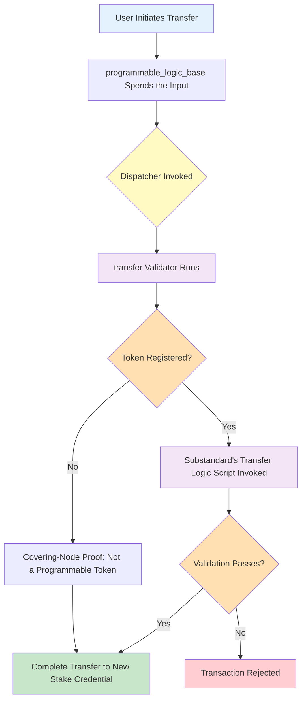

# Introduction to Programmable Tokens

**Programmable Tokens** are native Cardano assets enhanced with programmable lifecycle controls and transfer rules. They enable real-world assets like stablecoins and tokenized securities to operate on-chain while maintaining regulatory compliance.

---

## Table of Contents

1. [The Problem](#the-problem)
2. [What Are Programmable Tokens?](#what-are-programmable-tokens)
3. [How They Work (High-Level)](#how-they-work-high-level)
4. [Key Benefits](#key-benefits)
5. [The CIP-113 Standard](#the-cip-113-standard)
6. [Next Steps](#next-steps)

---

## The Problem

### Blockchain Tokens Lack Transfer Restrictions

Traditional blockchain tokens, including Cardano's native assets, are **permissionless by design**. Anyone can transfer tokens to anyone else without restriction. While this property is fundamental to decentralized systems, it creates significant challenges for regulated assets:

- **Stablecoins** need to comply with sanctions lists and anti-money laundering (AML) requirements
- **Tokenized securities** must enforce transfer restrictions based on jurisdiction and investor accreditation
- **Real-world assets** require mechanisms for freeze-and-seize in response to court orders or regulatory actions
- **Institutional assets** need compliance with securities regulations and KYC/AML frameworks

### The Gap Between Blockchain and Regulated Finance

The issuer of a regulated instrument remains legally accountable for it after issuance: they must be able to screen sanctioned parties, freeze or seize holdings under a court order, and restrict who may hold the asset. A plain native asset offers no mechanism for any of this — once tokens are issued, the issuer has no further control over where they move. Unable to meet their obligations on-chain, institutions have so far relied on workarounds.

**Existing approaches have limitations:**
- **Centralized custodians** - Reintroduce intermediaries and counterparty risk
- **Off-chain enforcement** - Cannot prevent unauthorized transfers at protocol level
- **Smart contract wrappers** - Break compatibility with standard wallets and infrastructure
- **Separate blockchains** - Fragment liquidity and interoperability

**What's needed**: A solution that adds programmable constraints to native tokens while preserving compatibility with existing Cardano infrastructure.

---

## What Are Programmable Tokens?

### Definition

**Programmable tokens are native Cardano assets with an additional layer of validation logic that executes on every transfer, mint, or burn operation.**

Phil DiSarro — author of the original reference implementation this codebase builds on — captured the intuition behind the design:

> *"Think of programmable tokens as a mini ledger within Cardano."*
> — from a [CIP-113 review comment](https://github.com/cardano-foundation/CIPs/pull/444#issuecomment-4084863264)

All programmable tokens live inside one shared custody address, and every movement within that space passes through the framework's validation — admission rules, transfer rules, issuer controls. The custody address behaves like a small, self-governing ledger embedded in Cardano's ledger, with its own entry and transfer rules, while the tokens themselves remain ordinary native assets. Most of the architecture in the following chapters falls out of this one idea: a ledger needs a registry of what it tracks (the on-chain directory), rules for what makes a movement valid (substandard logic), and a boundary that nothing crosses unchecked (the shared custody address).

They leverage Cardano's existing native token infrastructure and require no hard fork or ledger changes. However, because tokens are held at a shared script address with stake-credential-based ownership, wallets, explorers, and DEXes would require integration work to fully support them.

### Key Principle

All programmable tokens are locked in a **shared smart contract address**. Ownership is determined by **stake credentials**, allowing standard wallets to manage them while enabling unified validation across the entire token ecosystem.

This approach means:
- Payment credential is **shared** across all token holders (the programmable logic base address)
- Stake credential is **unique** per holder (determines ownership)
- Wallets could manage tokens if they resolve stake-credential-based ownership
- Every transfer automatically invokes validation logic

### Still Native Assets

**Important**: Programmable tokens are NOT a separate token standard or blockchain fork. They are **Cardano native assets** enhanced with lifecycle rules. Their minting policies, transfer rules, and burning operations are governed by additional smart contract logic, but they remain native tokens at the ledger level.

### Standard and Substandards

CIP-113 follows a layered design:

- **CIP-113 (Core Standard)** — The overarching framework that defines the shared infrastructure: the custody model (programmable logic base), the on-chain registry, the dispatch-and-delegate validation layer, and the token issuance mechanism. This framework is deployed once and shared by all programmable tokens. It requires no hard fork — everything is built on existing Cardano L1 features.

- **Substandards** — The actual rules that specific programmable tokens must obey. A substandard is a pluggable set of validators (typically stake scripts invoked via the withdraw-zero pattern) that define transfer logic, issuer controls, and any supporting on-chain state. Different tokens can use different substandards depending on their compliance requirements. Examples include:
  - **Simple permissioned transfer** — Requires a specific credential to authorize transfers
  - **Freeze and seize** — Denylist-aware transfer logic with on-chain sanctioned address management, freeze capabilities, and token seizure by authorized parties

This separation means the core framework remains stable and shared, while new substandards can be developed and deployed independently to support new compliance models without modifying the base protocol.

### Comparison: Native vs Programmable Tokens

| Aspect | Native Token | Programmable Token |
|--------|-------------|-------------------|
| **Asset Type** | Cardano native asset | Cardano native asset (enhanced) |
| **Transfer Rules** | Unrestricted | Programmable validation |
| **Custody** | Any address | Programmable logic address |
| **Ownership** | Payment credential | Stake credential |
| **Validation** | Ledger rules only | Ledger + custom logic |
| **Wallet Support** | Standard wallets | Requires integration* |
| **Explorer Support** | All explorers | Requires integration* |
| **DEX Compatibility** | Full | Requires integration* |

**\* Note**: Programmable tokens are native assets at the ledger level, but because they are held at a shared script address with ownership determined by stake credentials, wallets need to resolve stake-credential-based ownership to display balances, explorers need to attribute tokens to holders rather than the script address, and DEX contracts need to interact with the programmable logic validators. No hard fork or ledger changes are required — all programmable logic uses features already supported at the L1 level.

### Example Use Cases

**Regulated Stablecoins**:
- Denylist sanctioned addresses
- Freeze accounts pending investigation
- Seize tokens in response to court orders
- Maintain compliance with FATF travel rule

**Tokenized Securities**:
- Enforce investor accreditation requirements
- Restrict transfers by jurisdiction
- Implement lock-up periods
- Comply with securities regulations

**Real-World Assets**:
- Programmable vesting schedules
- Time-locked transfers
- Allowlist-only trading
- Custom compliance logic

---

## How They Work (High-Level)

Programmable tokens use a multi-layered architecture with on-chain registries, shared custody addresses, and pluggable validation scripts.

### Architecture Overview



The dispatcher — `programmable_logic_global` — requires the withdraw-zero of
one delegate validator: `transfer` for an ordinary transfer,
`third_party` for seizure or forced transfer, or `unfracking` for same-owner
restructuring (`validators/programmable_logic_global.ak:63-69`). The diagram
above follows the transfer path; [Key Components](#key-components) below
covers all three.

### Key Components

#### 1. Programmable Logic Address
All programmable tokens are held at a shared smart contract address. This address has:
- **Payment credential**: Shared across all token holders (the smart contract)
- **Stake credential**: Unique per holder (determines ownership)

When you transfer tokens, you're changing the stake credential while keeping the same payment credential.

#### 2. On-Chain Registry (Directory)
A sorted linked list of registered programmable token policies, stored as on-chain UTxOs. Each registry entry (`RegistryNode`, `lib/registry_node.ak:51-81`) contains:
- The policy's currency symbol (the list key) and the next key in sorted order, for traversal
- The minting-logic script credential — also the entry's issuance and lifecycle authority
- The transfer logic script credential, invoked by the `transfer` delegate
- The third-party logic script credential, invoked by the `third_party` delegate
- The unfracking logic script credential, invoked by the `unfracking` delegate when set — left unset, it forbids unfracking for that policy
- An optional global-state currency symbol (e.g., a denylist)

A registry proof is a **direct index into the transaction's reference inputs**, supplied by the redeemer and authenticated against the registry NFT policy, rather than a walk of the list. Its cost does not grow with the size of the registry; it grows only with the position of the referenced node among the reference inputs (`lib/registry_node.ak:83-108`, `validators/programmable_logic/transfer.ak:255-267`).

#### 3. Validation Scripts (Substandards)
Pluggable stake validators defined by substandards that enforce token-specific rules:
- **Transfer Logic**: Runs on every token transfer (e.g., denylist checks, allowlist validation)
- **Issuer Logic**: Controls minting, burning, and seizure operations

Different tokens can use different substandards — each substandard is registered in the on-chain registry and invoked automatically by the core framework. Scripts are invoked using the **withdraw-zero pattern** — stake validators are triggered with 0 ADA withdrawals.

#### 4. Dispatcher (`programmable_logic_global`)
Spending a programmable-token UTxO always runs `programmable_logic_base` (PLB), the shared validator behind every programmable logic address. PLB does the smallest possible job: it reads one credential from the protocol-params reference input and requires that credential's withdraw-zero (`validators/programmable_logic_base.ak:66-74`). That credential names `programmable_logic_global`, the dispatcher.

The dispatcher has exactly one job of its own: given the action the redeemer names — an ordinary transfer, a third-party action, or an unfracking restructuring — require the withdraw-zero of the delegate validator responsible for that action (`validators/programmable_logic_global.ak:63-69`). It reads no datum and looks up nothing in the registry; that work belongs to the delegate.

#### 5. Delegate Validators (`transfer`, `third_party`, `unfracking`)
The dispatcher's redeemer names one delegate and requires its withdraw-zero (`validators/programmable_logic_global.ak:63-69`); the check is a lower bound; it does not exclude some other script's withdraw-zero also being present. Each delegate is a standalone withdraw-zero validator:
- **`transfer`** — the ordinary path. It walks the registry proofs supplied in its own redeemer, requires the withdraw-zero of the substandard's own transfer logic script for every registered policy touched, checks that the tokens reappear with the correct value, and confirms whoever owns the spent input consented — a signature for a verification-key owner, that script's withdraw-zero for a script owner (`validators/programmable_logic/owner.ak:28-39`, called from `validators/programmable_logic/transfer.ak:98`).
- **`third_party`** — seize, clawback, freeze enforcement. Authorised by the policy's own third-party logic script, not by the holder (`validators/programmable_logic/third_party.ak:29`).
- **`unfracking`** — holder-driven, same-owner restructuring. Requires the policy's unfracking logic script's withdraw-zero, when the registry node sets one (`validators/programmable_logic/unfracking.ak:120`).

### Transaction Flow Example

Let's walk through a simple transfer:

1. **Alice wants to send 100 USDC tokens to Bob**
   - Alice's tokens are at: `addr1...programmable_logic_base` + `stake1...alice`
   - Bob will receive at: `addr1...programmable_logic_base` + `stake1...bob`

2. **Transaction is built**:
   - Input: Alice's UTxO (100 USDC)
   - Output: New UTxO with Bob's stake credential (100 USDC)
   - Signature: Alice signs with her stake key

3. **Validation executes**:
   - PLB requires the dispatcher's withdraw-zero, the dispatcher requires the `transfer` delegate's withdraw-zero
   - `transfer` checks Alice's signature (she is a verification-key owner) ✓
   - Registry proof finds USDC is registered, and requires the substandard's transfer logic script's withdraw-zero ✓
   - Transfer logic script runs (e.g., checks denylist) ✓
   - Tokens go to programmable address with Bob's stake credential ✓

4. **Result**: Bob now owns the tokens at the shared address with his stake credential.

### Security Model

**Ownership Verification**:
- Every input from the programmable logic address that is spent on the holder's own authority — an ordinary transfer or an unfracking restructuring — must be authorized by that address's stake credential (`validators/programmable_logic/owner.ak:28-39`)
- Authorization = a signature from the stake key (verification-key owner) OR that script's withdraw-zero (script owner)
- If any such input lacks authorization, the transaction fails
- Third-party actions do not go through this check: no line in the `third_party` validator's withdraw handler (`validators/third_party.ak:44-74`) or in its invariants module (`validators/programmable_logic/third_party.ak`) calls the owner check or reads `extra_signatories` — the path's only authorisation step is the subject policy's own third-party logic script's withdraw-zero (`validators/programmable_logic/third_party.ak:29`), never the holder

**Registry Authenticity**:
- Registry-node NFTs carry the `registry` validator's own minting policy, and only its mint handler can mint one — the origin node at genesis, one more per subsequent insertion, each shape-checked and cryptographically bound to the policy it represents before it is minted (`validators/registry.ak:50-172`)
- A delegate authenticates the node it reads by checking that NFT policy, not just its position (`lib/registry_node.ak:98-100`)
- This is what prevents a forged registry entry from ever being read as genuine

**Governed, transparent rules**:
- A token's transfer and third-party logic can change only through the registry's authorized update path (`validators/registry.ak:214-236`), and only within a fixed envelope: the update is guarded by `lib/linked_list.ak:184-209`, which freezes the policy ID and the issuance authority and permits only the transfer, third-party, unfracking and global-state fields to change
- Every update is on-chain, retroactive, and visible to holders (integrators read the live registry node rather than caching its rules)
- Issuer controls are explicitly defined at registration time

---

## Key Benefits

### For Asset Issuers

**Automated Compliance**:
- Transfer restrictions enforced at protocol level
- No need for off-chain monitoring systems
- Reduced operational overhead and compliance costs

**Flexible Controls**:
- Freeze/seize capabilities for regulatory compliance
- Custom validation logic for specific use cases
- Composable with other smart contracts

**Institutional Grade**:
- Predictable behavior (code is law)
- Transparent rules visible on-chain
- Auditable transaction history

### For Token Holders

**Native Asset Foundation**:
- Built on Cardano's native token infrastructure, no hard fork required
- Wallets and explorers can support them with stake-credential-aware integration
- Tokens remain native assets at the ledger level

**Transparent Rules**:
- Validation logic is public; any change goes through the registry's authorized update path and is visible on-chain
- Users know exactly what restrictions apply (by reading the live registry entry)
- No hidden centralized controls (beyond those explicitly coded)

**Native Asset Benefits**:
- First-class ledger support
- Low transaction fees
- High throughput

### For the Cardano Ecosystem

**Interoperability**:
- Standard interface (CIP-113) enables ecosystem integration
- DeFi protocols can support programmable tokens
- Bridges and oracles can integrate easily

**Composability**:
- Programmable tokens work with other smart contracts
- Can be used in DEXes, lending protocols, DAOs
- Enables complex DeFi primitives

**Institutional Adoption**:
- Lowers barriers for regulated asset issuance
- Attracts traditional finance institutions
- Expands Cardano's use cases

---

## The CIP-113 Standard

This implementation targets **[CIP-113 (Programmable token-like assets)](https://github.com/cardano-foundation/CIPs/pull/444)**, which defines the framework for programmable tokens on Cardano. The proposal has reached the CIP editors' **Last Check** stage — the final review window before merge — so late specification changes are still possible.

This codebase has been through a professional security audit; the findings from that review are resolved and the code is production-ready. CIP-113 itself has not yet been accepted as a Cardano Improvement Proposal — track the proposal's status at the link above.

### Lineage: CIP-143

The architecture originates in **[CIP-143 (Interoperable Programmable Tokens)](https://cips.cardano.org/cip/CIP-0143)** and its reference implementation by Phil DiSarro and the IOG team ([wsc-poc](https://github.com/input-output-hk/wsc-poc)). CIP-113 supersedes CIP-143 as the more comprehensive standard; this codebase is the Aiken migration of that reference implementation, adapted to CIP-113.

### Standards Compliance

Programmable tokens enable compliance with various regulatory frameworks including stablecoin standards and tokenized securities requirements. The architecture supports implementation of controls required by financial regulations while maintaining the decentralized nature of Cardano.

---

## Next Steps

Now that you understand what programmable tokens are and why they exist, you can dive deeper:

### Learn More

- **[Architecture](./02-ARCHITECTURE.md)** - System design, validator coordination, on-chain data structures, and validation flows
- **[Developing Substandards](./09-DEVELOPING-SUBSTANDARDS.md)** - Guide for implementing new substandards with custom compliance logic

### Try It Out

```bash
aiken build
aiken check
```

### Additional Resources

- 📖 [Main README](../README.md) - Project overview and quick start
- 🏛️ [Architecture Deep-Dive](./02-ARCHITECTURE.md) - Validator coordination, data structures, and validation flows

---

**Questions or feedback?** Open an issue in the repository or check the [Aiken Discord](https://discord.gg/Vc3x8N9nz2) for community support.
