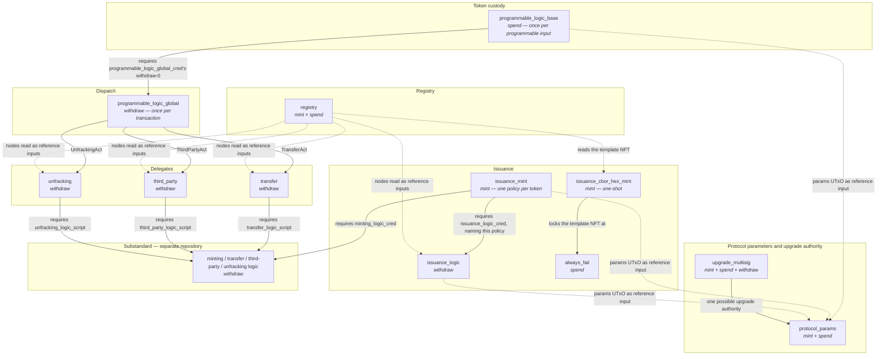
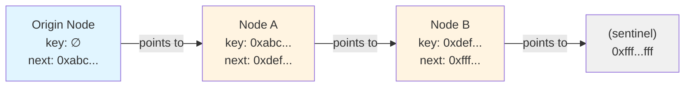
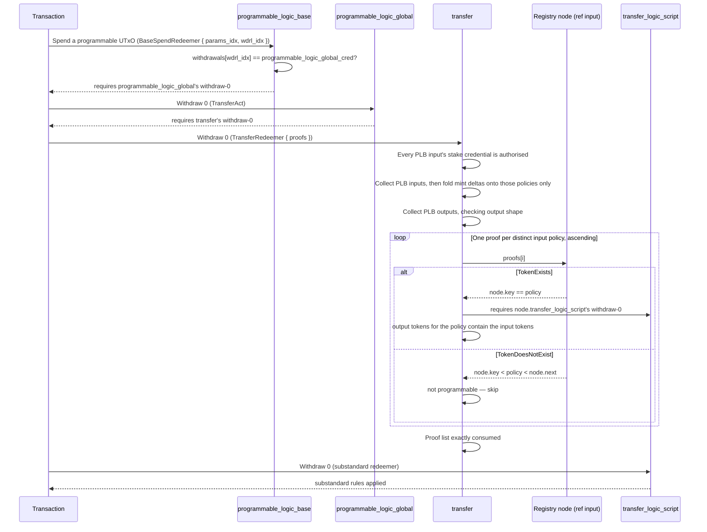

# Architecture Deep-Dive

This document describes the on-chain architecture of the CIP-113 programmable
tokens implementation in Aiken: the ownership model, the dispatch chain, the
on-chain data structures, the ledger-shape rules a transaction builder must
satisfy, the upgrade path, and the step-by-step validation flows.

Every rule stated here names the validator and the line that enforces it. Paths
are relative to the repository root.

---

## Table of Contents

1. [Ownership Model](#ownership-model)
2. [Validator Architecture](#validator-architecture)
3. [Withdraw-Zero Pattern](#withdraw-zero-pattern)
4. [On-Chain Registry](#on-chain-registry)
5. [Denylist System](#denylist-system)
6. [Data Structures](#data-structures)
7. [Validation Flows](#validation-flows)
8. [Ledger Shape Rules](#ledger-shape-rules)
9. [Upgradability](#upgradability)
10. [Security Properties](#security-properties)

---

## Ownership Model

### Shared payment credential, unique stake credentials

A Cardano address is a **payment credential** plus a **stake credential**.
Programmable tokens use a single shared payment credential — the
`programmable_logic_base` script hash, PLB below — while ownership is carried by
the stake credential.

```
Cardano Address = Payment Credential + Stake Credential
                  ─────────────────   ────────────────
                  Shared across ALL    Unique per holder
                  programmable tokens  (determines ownership)
```

This means:

- **Every programmable token lives at an address whose payment credential is
  PLB.** Spending any of them runs the same spending validator,
  `validators/programmable_logic_base.ak:51`.
- **Ownership is the stake credential** — a verification key for a wallet
  holder, a script hash for contract-controlled holdings. The authorisation rule
  is one function: a verification-key credential must sign, a script credential
  must present a withdraw-zero, `validators/programmable_logic/owner.ak:28-39`.
- **A PLB output must carry an INLINE stake credential.** An output at the PLB
  payment credential with no stake credential, or with a pointer credential, has
  no owner that `owner.ak` can ever authorise, so it would be permanently
  unspendable. The rule is enforced wherever a PLB output is created —
  `lib/prog_assets.ak:218` for transfers,
  `validators/programmable_logic/third_party.ak:156` for third-party
  destinations, `validators/issuance_logic.ak:193` at issuance.
- **Wallets need integration.** The tokens are ordinary native assets at the
  ledger level, but a wallet must resolve stake-credential ownership at a shared
  script address to show the right balance.

### Transferring tokens

A transfer changes the stake credential and keeps the payment credential:

```
Before:  addr(programmable_logic_base, stake_alice) → 100 USDC
After:   addr(programmable_logic_base, stake_bob)   → 100 USDC
```

Who owns the UTxO changes; where it lives does not.

---

## Validator Architecture

The protocol is twelve validators. `plutus.json` carries one blueprint entry per
handler, including each validator's `else` fallback.

The chain that authorises an ordinary spend has three links plus the
substandard's own script:



Solid arrows are requirements one script imposes on another within a
transaction; dotted arrows are reference-input reads. The substandard box is a
different repository — see
[`substandards/`](https://github.com/cardano-foundation/cip113-programmable-tokens-platform/tree/main/src/substandards).

### Validator reference

Parameters are transcribed from the `validator` declarations, in declaration
order. A parameter is applied at deployment and baked into the script hash.

| Validator | Handlers | Parameters | Declared at | Purpose |
|---|---|---|---|---|
| `always_fail` | spend | `_nonce: ByteArray` (1) | `validators/always_fail.ak:5` | Unspendable address. Locks the issuance-template NFT. The nonce makes each deployment a distinct hash. |
| `issuance_cbor_hex_mint` | mint | `utxo_ref: OutputReference`, `always_fail_hash: ByteArray` (2) | `validators/issuance_cbor_hex_mint.ak:13-16` | One-shot mint of the reference NFT holding the issuance script template, locked at `always_fail_hash` (`:34`, `:49`). |
| `issuance_logic` | withdraw, publish | `programmable_logic_base_cred: Credential`, `registry_node_cs: PolicyId`, `params_policy: PolicyId`, `max_inline_datum_bytes: Int` (4) | `validators/issuance_logic.ak:44-62` | The protocol's replaceable issuance rules: registry proof, custody of the minted supply, output shape. One entry per policy issued (`:69-83`). |
| `issuance_mint` | mint | `minting_logic_cred: Credential`, `params_policy: PolicyId` (2) | `validators/issuance_mint.ak:34-41` | The permanent per-token minting policy. Its hash IS the token's policy id. Requires the substandard's minting logic (`:46`) and the protocol's issuance logic covering this policy (`:52-63`). |
| `programmable_logic_base` | spend | `params_policy: PolicyId` (1) | `validators/programmable_logic_base.ak:50` | Custody of every programmable-token UTxO. Reads one credential from the protocol-params datum and requires its withdraw-zero (`:66-74`). |
| `programmable_logic_global` | withdraw, publish | `transfer_hash: ScriptHash`, `third_party_hash: ScriptHash`, `unfracking_hash: ScriptHash` (3) | `validators/programmable_logic_global.ak:48-52` | The dispatcher. Turns the redeemer's action into a requirement that the matching delegate ran (`:63-69`). |
| `protocol_params` | mint, spend | `utxo_ref: OutputReference` (1) | `validators/protocol_params.ak:228` | One-shot mint of the protocol-params NFT (`:229-273`) and the guard on the UTxO that carries it (`:276-341`). |
| `registry` | mint, spend | `utxo_ref: OutputReference`, `issuance_cbor_hex_cs: PolicyId` (2) | `validators/registry.ak:49` | The sorted linked list of registered policies: the mint handler owns list structure and the token-id binding (`:50-172`), the spend handler guards every node (`:174-238`). |
| `third_party` | withdraw, publish | `programmable_logic_base_cred: Credential`, `registry_node_cs: PolicyId`, `max_inline_datum_bytes: Int` (3) | `validators/third_party.ak:39-43` | Third-party actions — forced transfer, seizure, freeze enforcement, burn — for exactly one policy per transaction. |
| `transfer` | withdraw, publish | `programmable_logic_base_cred: Credential`, `registry_node_cs: PolicyId`, `max_inline_datum_bytes: Int` (3) | `validators/transfer.ak:35-39` | Ordinary transfers: ownership, registry proofs, containment at PLB. |
| `unfracking` | withdraw, publish | `programmable_logic_base_cred: Credential`, `registry_node_cs: PolicyId`, `max_inline_datum_bytes: Int` (3) | `validators/unfracking.ak:55-59` | Holder-driven, same-owner restructuring of the holder's own PLB UTxOs for one policy, gated by that policy's unfracking hook. |
| `upgrade_multisig` | mint, spend, withdraw, publish | `utxo_ref: OutputReference` (1) | `validators/upgrade_multisig.ak:73` | A reference upgrade authority: an approval tree in a config UTxO, satisfied on `withdraw` (`:154-174`). One possible authority, not a required part of the protocol. |

Three values recur as parameters and are worth naming, because they are
sometimes mistaken for datum fields:

- `programmable_logic_base_cred` and `registry_node_cs` are parameters of
  `transfer` (`validators/transfer.ak:36-37`), `third_party`
  (`validators/third_party.ak:40-41`), `unfracking`
  (`validators/unfracking.ak:56-57`) and `issuance_logic`
  (`validators/issuance_logic.ak:47`, `:49`).
- `max_inline_datum_bytes` is a parameter of those same four scripts
  (`validators/transfer.ak:38`, `validators/third_party.ak:42`,
  `validators/unfracking.ak:58`, `validators/issuance_logic.ak:61`) and carries
  a deployment invariant — see [Ledger Shape Rules](#ledger-shape-rules).
- `params_policy` — the one-shot protocol-params NFT policy — is a parameter of
  `programmable_logic_base` (`validators/programmable_logic_base.ak:50`),
  `issuance_mint` (`validators/issuance_mint.ak:40`) and `issuance_logic`
  (`validators/issuance_logic.ak:53`). Those three are the only scripts that
  read the protocol-params datum.

### The dispatch chain

`programmable_logic_base` runs once per programmable-token input, so its cost is
multiplied by every such input in the transaction. It therefore does the
smallest job in the protocol: locate the protocol-params UTxO among the
reference inputs at the redeemer's `params_idx`, read **one** field out of its
datum — `programmable_logic_global_cred`, field 0 — and require that
credential's withdraw-zero at the redeemer's `wdrl_idx`. There is no action arm
and no choice of accessor.

```aiken
validator programmable_logic_base(params_policy: PolicyId) {
  spend(
    _datum: Option<Data>,
    redeemer: BaseSpendRedeemer,
    _own_ref: Data,
    self: Transaction,
  ) {
    trace @"Starting programmable_logic_base validation"

    let BaseSpendRedeemer { params_idx, wdrl_idx } = redeemer

    // Locate the protocol-params NFT among the reference inputs (addressed by
    // the redeemer's `params_idx`) and pull the live dispatcher credential out
    // of its datum. The params UTxO is already a mandatory reference input on
    // every programmable-token transaction, so this adds no availability
    // requirement.
    let fields <- params.with_protocol_params_fields(
      self.reference_inputs,
      params_policy,
      params_idx,
    )

    let Pair(witnessed, _) = list.expect_at(self.withdrawals, wdrl_idx)

    (witnessed == params.programmable_logic_global_cred_field(fields))?
  }
```

Quoted from `validators/programmable_logic_base.ak:50-75`.

`wdrl_idx` is a position in the ledger's canonical withdrawal ordering — script
credentials first, then verification-key credentials, bytewise within each
group — over the transaction's complete withdrawal set. The lookup is a direct
`list.expect_at` (`:72`), so it drops `wdrl_idx` list cells and performs no
credential comparison on the way. It is self-validating: a wrong index resolves
to some other credential, the equality at `:74` fails, and a dishonest witness
can only invalidate its own transaction.

Because PLB compares exactly one credential, there is no pairwise-distinctness
hypothesis anywhere on this path. The credential it compares is a **datum
field**, not a parameter, which is what makes the dispatch layer replaceable
without moving PLB's hash — and therefore without moving a single token address.
See [Upgradability](#upgradability).

`programmable_logic_global` is where the action is chosen. It takes the three
delegate hashes as parameters, so it never reads the protocol-params datum; its
redeemer selects one and requires that script's withdraw-zero:

- `TransferAct` → the `transfer` validator, `validators/programmable_logic_global.ak:64`
- `ThirdPartyAct` → the `third_party` validator, `:65`
- `UnfrackingAct` → the `unfracking` validator, `:66`

with the requirement itself at `:69`. A redeemer naming the wrong action
resolves to a delegate that is not present in the withdrawal set, so it too can
only invalidate its own transaction.

The delegate does the work. Each one runs **once per transaction**, reads the
subject policy's registry node as a reference input, and requires that node's
credential for its own kind of action. No delegate is ever reached through
another: a transaction loads PLB, `programmable_logic_global`, and at least the
delegate its redeemer names (`validators/programmable_logic_global.ak:63-69`).

The arms of `ProgrammableLogicGlobalRedeemer` carry no payload
(`lib/types.ak:100-109`). Everything a delegate needs — registry proofs, node
indices, output offsets — travels in that delegate's own redeemer, where the
delegate validates it. Duplicating any of it in the dispatcher would create a
second, unchecked claim about the same fact.

---

## Withdraw-Zero Pattern

The **withdraw-zero pattern** invokes a stake validator without any staking
activity. A transaction includes a withdrawal of 0 ADA from a script's reward
address, which makes the ledger execute that script's `withdraw` handler.

### How it works

1. The transaction includes `withdrawals: [(script_credential, 0)]`.
2. The ledger sees a withdrawal from a script reward account and runs the
   validator.
3. The `withdraw` handler executes with the full transaction context.
4. The 0 ADA withdrawal has no economic effect. It is a trigger.

### Why it matters

1. **One execution for many inputs.** A spending validator runs once per input;
   a stake validator runs once per transaction. The registry walk, the ownership
   sweep and the containment check live behind a withdrawal
   (`validators/transfer.ak:40`), so a multi-input transfer pays for them once.
2. **Composable validation.** Several stake validators run in the same
   transaction, each checking a different thing — the dispatcher, the delegate,
   and the policy's own logic.
3. **Pluggable logic.** A substandard's scripts are registered in the on-chain
   registry as credentials (`lib/registry_node.ak:62-78`), so new logic is
   deployed without touching any core validator.

### In practice

An ordinary transfer carries **three** withdraw-zeros:

```
withdrawals:
  - (programmable_logic_global, 0 ADA)   # required by PLB
  - (transfer,                  0 ADA)   # required by programmable_logic_global
  - (transfer_logic_script,     0 ADA)   # required by transfer, per policy
```

- PLB requires `programmable_logic_global_cred`,
  `validators/programmable_logic_base.ak:72-74`.
- `programmable_logic_global` requires `transfer` under `TransferAct`,
  `validators/programmable_logic_global.ak:64`, `:69`.
- `transfer` requires the registry node's `transfer_logic_script` for every
  policy proved present, `validators/programmable_logic/transfer.ak:264`.

A third-party action carries `programmable_logic_global`, `third_party` and the
node's `third_party_logic_script`
(`validators/programmable_logic/third_party.ak:29`). An unfracking action
carries `programmable_logic_global`, `unfracking` and the node's
`unfracking_logic_script` (`validators/programmable_logic/unfracking.ak:120`).
An issuance carries two — see [Ledger Shape Rules](#ledger-shape-rules).

Every withdraw-zero credential must be a **registered** stake credential before
it can appear in a withdrawal, which is what the `publish` handlers exist for;
they are listed in [Ledger Shape Rules](#ledger-shape-rules).

---

## On-Chain Registry

The registry is a **sorted linked list** of registered programmable-token
policies, stored as UTxOs. Each node is a UTxO carrying an NFT marker and an
inline datum. One validator owns it, `registry`
(`validators/registry.ak:49`): the `mint` handler owns list structure, the
`spend` handler guards every node.

### Structure



Each node is a UTxO with:

- **an NFT** whose policy is the `registry` script's own hash — token name equal
  to `key`, empty for the origin node. The origin node's address is that same
  hash wearing its spending hat, `validators/registry.ak:66-71`;
- **an inline datum** of type `RegistryNode`, `lib/registry_node.ak:51-81`.

### Membership proofs

A proof is a **direct index into `reference_inputs`**, supplied by the redeemer,
not a walk of the list. Its cost is constant in the length of the registry and
grows only with the position of the node in the reference-input list
(`aiken_list.expect_at`, `validators/third_party.ak:97`;
`new_registry_node_getter`, `lib/registry_node.ak:83-108`). A wrong index
resolves to a UTxO that fails authentication — the addressed node's first
non-ADA policy must be the registry NFT policy
(`lib/registry_node.ak:98-99`, `validators/third_party.ak:102`).

**Token exists** (`TokenExists { node_idx }`) — the addressed node is checked by
`validators/programmable_logic/transfer.ak:255-267`:

1. the node carries an authentic registry NFT;
2. `node.key == policy` (`:261`);
3. `node.transfer_logic_script` is in the transaction's withdrawals (`:264`).

**Token does not exist** (`TokenDoesNotExist { node_idx }`) — the addressed node
covers the policy: `node.key < policy < node.next`
(`validators/programmable_logic/transfer.ak:273-274`). Because the list is
sorted and complete, that proves no node with that key exists.

```
Covering node proof:

  node.key  = 0xabc...   (less than target)
  target    = 0xbcd...   (the policy we're looking up)
  node.next = 0xdef...   (greater than target)

  → 0xbcd... is NOT in the registry
```

This is how the `transfer` validator handles non-programmable tokens sitting in
the same transaction: it does not reject them, it requires a covering proof and
skips them (`validators/programmable_logic/transfer.ak:269-278`).

### Insertion

Inserting a policy (`RegistryInsert`, `validators/registry.ak:73-170`):

1. find the covering node where `covering.key < new_key < covering.next`;
2. spend the covering node UTxO (`:121-124`);
3. create two node outputs — the covering node with `next` → `new_key`, and the
   new node with `key` = `new_key`, `next` = the old `covering.next`
   (`:134-169`);
4. mint exactly one node NFT named `new_key` (`:113`);
5. prove `new_key` is a legitimate programmable-token policy id, by
   reconstructing the issuance script from the `IssuanceCborHex` template and
   hashing it (`:91-97`);
6. present the substandard's `minting_logic_script` withdraw-zero (`:109-110`).

```
Before:  [covering: key=A, next=C]
After:   [covering: key=A, next=B]  [new: key=B, next=C]
```

The `RegistryInsert` branch places no constraint on whether a first mint of the
new policy rides along in the same transaction. If one does, `issuance_mint`
validates it as any other mint (`validators/issuance_mint.ak:42-64`); a
registration carrying no mint at all is equally valid, which is why the
substandard's withdraw-zero is required explicitly at
`validators/registry.ak:109-110` rather than inferred from a mint.

### Node updates

A node's four logic fields are mutable in place; `key`, `next` and
`minting_logic_script` are frozen. The rule is one record equality,
`lib/linked_list.ak:184-208`: `transfer_logic_script`,
`third_party_logic_script`, `unfracking_logic_script` and `global_state_cs` may
move, and each must stay well formed (`:198-207`). An update is authorised by
the node's own `minting_logic_script` withdraw-zero, and a
verification-key credential in that field cannot authorise one
(`validators/registry.ak:227-234`).

### Registration contention

An insertion **spends the covering node** and re-creates it at a new output
reference; an in-place node update does the same. This is intrinsic to a linked
list — adding or changing a node re-points its predecessor — and it has a
concurrency consequence.

Membership and non-membership proofs reference a registry node as a **reference
input**, and a reference input must be a live UTxO at validation time. So when
one transaction consumes node *N*, any other transaction that referenced *N* by
its now-spent output reference is invalid and must be rebuilt against *N*'s new
UTxO. Concretely, a transfer whose proof points at *N* — a `TokenExists` proof
for *N*, or a `TokenDoesNotExist` covering proof that uses *N* — races a
registration or update that touches *N*.

Consequences:

- **User experience.** A transfer that races a registration touching its
  referenced node fails and must be rebuilt against the updated node.
  Registrations are infrequent and the contention is limited to transactions
  referencing the specific node being touched, but builders handle the retry
  (see [`08-INTEGRATION-GUIDES.md`](./08-INTEGRATION-GUIDES.md)).
- **Griefing.** An actor who repeatedly registers around — or otherwise spends —
  a particular node can transiently block transactions that depend on it. The
  impact is protocol-specific and matters most for time-sensitive flows such as
  auctions and liquidations. It is not a custody or escape risk.

This is a limitation of the on-chain linked-list design. Heavier registry
structures exist — a parallel array or Merkle-tree registry that proves
membership without consuming a node, or a further register/mint separation — but
they add redundancy, cost and complexity out of proportion to the impact. The
mitigation is off-chain: resolve the covering node at build time, re-resolve and
rebuild on failure, and avoid making one contended node a hard dependency of a
time-critical operation.

---

## Denylist System

> **Note:** the denylist belongs to the
> [freeze-and-seize substandard](https://github.com/cardano-foundation/cip113-programmable-tokens-platform/tree/main/src/substandards/freeze-and-seize),
> not to the core framework, and its rules are enforced in that repository. It
> is described here because it illustrates how a substandard extends the core.
> This section is the one exception to the citation rule above: nothing it
> states is verifiable from this repository, because nothing it describes is
> defined here — `BlacklistNode`, the operations table and the non-membership
> proof all live in `cip113-programmable-tokens-platform`, under
> `src/substandards/freeze-and-seize`.

The denylist uses the same sorted-linked-list shape as the registry, keyed on
credential hashes instead of policy ids.

### Structure

Each `BlacklistNode` carries:

- `key`: the denylisted credential hash (28 bytes)
- `next`: the next credential hash in sorted order

### Operations

| Operation | Description | Authorization |
|---|---|---|
| `BlacklistInit` | Create the origin node | One-shot (UTxO consumed) |
| `BlacklistInsert` | Add a credential | Manager signature |
| `BlacklistRemove` | Remove a credential | Manager signature |

### Non-membership proofs in transfers

The substandard's transfer logic extracts the stake credential of every
programmable-token input, requires a `NonmembershipProof { node_idx }` per
distinct credential, and checks `node.key < credential_hash < node.next` for
each. A denylisted credential has no covering node, so the transaction fails.

The transaction therefore carries one proof per distinct stake credential in the
inputs. Each proof is a direct reference-input index, like a registry proof.

---

## Data Structures

### RegistryNode

Seven fields, `lib/registry_node.ak:51-81`. Field order is the CBOR layout that
off-chain code encodes and decodes.

```aiken
pub type RegistryNode {
  key: ByteArray,                        // 0 — policy id of the registered token
  next: ByteArray,                       // 1 — next key in sorted order
  minting_logic_script: Credential,      // 2 — issuance and lifecycle authority
  transfer_logic_script: Credential,     // 3 — invoked by `transfer`
  third_party_logic_script: Credential,  // 4 — invoked by `third_party`
  unfracking_logic_script: Credential,   // 5 — invoked by `unfracking`
  global_state_cs: ByteArray,            // 6 — optional global-state NFT policy
}
```

- Field 2 is bound to `key` cryptographically at registration: the issuance
  template parameterised with this credential must hash to `key`
  (`validators/registry.ak:91-97`), so the field cannot lie. It also authorises
  node updates (`validators/registry.ak:227-234`).
- Fields 3, 4 and 5 are the three credentials the delegates require. Field 5 is
  **default-deny**: `empty_vkey` means unfracking is forbidden for this policy,
  because no ledger transaction can carry a withdrawal keyed by an empty hash
  (`validators/programmable_logic/unfracking.ak:120`).
- Fields 3, 4, 5 and 6 are the mutable set (`lib/linked_list.ak:189-207`).

### BlacklistNode (freeze-and-seize substandard)

```aiken
type BlacklistNode {
  key: ByteArray,   // Denylisted credential hash
  next: ByteArray,  // Next key in sorted order
}
```

### ProtocolParams

Six fields, `validators/programmable_logic/params.ak:54-103`. The datum lives in
the UTxO marked by the one-shot protocol-params NFT. Each field below names its
**sole on-chain reader** besides `protocol_params` itself, which validates the
whole record on both of its handlers (`validators/protocol_params.ak:105-113`,
reached from `:264` and `:322`).

```aiken
pub type ProtocolParams {
  programmable_logic_global_cred: Credential,   // 0
  issuance_logic_cred: Credential,              // 1
  transfer_cred: Credential,                    // 2
  third_party_cred: Credential,                 // 3
  upgrade_cred: Credential,                     // 4
  pending_upgrade_cred: Option<Credential>,     // 5
}
```

| # | Field | Read by | At |
|---|---|---|---|
| 0 | `programmable_logic_global_cred` | `programmable_logic_base`, once per programmable input | `validators/programmable_logic_base.ak:74` |
| 1 | `issuance_logic_cred` | `issuance_mint`, once per issuance transaction | `validators/issuance_mint.ak:59` |
| 2 | `transfer_cred` | `issuance_logic`, to locate the `transfer` withdraw-zero's redeemer | `validators/issuance_logic.ak:287` |
| 3 | `third_party_cred` | `issuance_logic`, to locate the `third_party` withdraw-zero's redeemer | `validators/issuance_logic.ak:298` |
| 4 | `upgrade_cred` | `protocol_params`, to decide who may rewrite this datum | `validators/protocol_params.ak:154` |
| 5 | `pending_upgrade_cred` | `protocol_params`, the standing nomination | `validators/protocol_params.ak:190`, `:217` |

Fields 0 to 3 have positional accessors that walk only as far as they must —
four of them, and no more
(`validators/programmable_logic/params.ak:149-175`). Fields 4 and 5 are reached
by deserialising the whole record instead, on `protocol_params`' cold path
(`validators/protocol_params.ak:142`).

The three delegates read this datum **zero** times: the values they need are
compile-time parameters (`validators/transfer.ak:35-39`,
`validators/third_party.ak:39-43`, `validators/unfracking.ak:55-59`). The
protocol-params UTxO is still a mandatory reference input on every
programmable-token transaction, because PLB reads it.

### Redeemers

**`programmable_logic_base` spend** (`lib/types.ak:79-84`) — a single-constructor
record, no action arm:

```aiken
pub type BaseSpendRedeemer {
  params_idx: Int,   // protocol-params UTxO in reference_inputs
  wdrl_idx: Int,     // programmable_logic_global_cred in the ledger-ordered withdrawals
}
```

**`programmable_logic_global` withdraw** (`lib/types.ak:100-109`) — three
field-less arms:

```aiken
pub type ProgrammableLogicGlobalRedeemer {
  TransferAct
  ThirdPartyAct
  UnfrackingAct
}
```

**`transfer` withdraw** (`lib/types.ak:27-30`) — one field. `transfer` reads no
protocol-params datum, so it carries no `params_idx`:

```aiken
pub type TransferRedeemer {
  // One proof per distinct policy in the PLB inputs, ascending policy order
  proofs: List<RegistryProof>,
}
```

**`third_party` withdraw** (`lib/types.ak:50-54`) — one policy per transaction,
named by its registry node:

```aiken
pub type ThirdPartyRedeemer {
  registry_node_idx: Int,   // the subject policy's node in reference_inputs
  outputs_start_idx: Int,   // where the paired continuing outputs begin
}
```

**`unfracking` withdraw** (`lib/types.ak:36-40`) — same shape, same discipline:

```aiken
pub type UnfrackingRedeemer {
  registry_node_idx: Int,
  outputs_start_idx: Int,
}
```

**Registry proofs** (`lib/types.ak:11-16`):

```aiken
pub type RegistryProof {
  TokenExists { node_idx: Int }        // the matching registry node
  TokenDoesNotExist { node_idx: Int }  // the covering node
}
```

**`issuance_mint` mint** (`lib/types.ak:172-174`) — an index hint and nothing
else, so the permanent policy's type can stay frozen for as long as any token
exists:

```aiken
pub type IssuanceMintRedeemer {
  params_idx: Int,
}
```

**`issuance_logic` withdraw** (`lib/types.ak:184-185`, `:162-165`) — one entry
per policy issued in the transaction. The keys are the frozen interface between
the two scripts: `issuance_mint` decodes this value only as far as
`Pairs<PolicyId, Data>` and asks whether its own policy is a key
(`validators/issuance_mint.ak:88-92`).

```aiken
pub type IssuanceLogicRedeemer =
  Pairs<PolicyId, MintingRegistryProof>

pub type MintingRegistryProof {
  RefInput { index: Int }     // registry node already exists
  // registry node is an output of this transaction (first mint, re-emitted
  // covering node, or in-place update)
  OutputIndex { index: Int }
}
```

**`registry` mint** (`lib/types.ak:188-216`):

```aiken
pub type RegistryRedeemer {
  RegistryInit
  RegistryInsert { key: ByteArray, minting_logic_script: Credential }
}
```

**`protocol_params` spend** (`lib/types.ak:133-146`) — see
[Upgradability](#upgradability):

```aiken
pub type ProtocolParamsRedeemer {
  ProtocolUpgrade
  NominateAuthority
  PromoteAuthority
}
```

**Denylist proofs** (`BlacklistProof`, freeze-and-seize substandard):

```aiken
type BlacklistProof {
  NonmembershipProof { node_idx: Int } // Points to the covering node
}
```

### IssuanceCborHex

The registration template, held in the NFT locked at the always-fail address
(`lib/types.ak:221-226`):

```aiken
pub type IssuanceCborHex {
  prefix_cbor_hex: ByteArray,
  postfix_cbor_hex: ByteArray,
}
```

The `registry` mint handler reconstructs the script as
`version_header ++ prefix ++ hashed_param ++ postfix`, hashes it with
blake2b_224, and requires the result to equal the policy id being registered
(`validators/registry.ak:91-97`). `hashed_param` is the inner 28-byte hash of
the `minting_logic_script` credential, derived inside the validator rather than
supplied.

### MultisigScript

The approval tree of the reference upgrade authority, held in that authority's
config UTxO datum (`lib/multisig.ak:32-40`):

```aiken
pub type MultisigScript {
  Signature { key_hash: ByteArray }
  AllOf { scripts: List<MultisigScript> }
  AnyOf { scripts: List<MultisigScript> }
  AtLeast { required: Int, scripts: List<MultisigScript> }
  Before { time: Int }
  After { time: Int }
  Script { script_hash: ByteArray }
}
```

---

## Validation Flows

### Transfer



Line by line:

| Step | Enforced at |
|---|---|
| PLB requires the dispatcher's withdraw-zero | `validators/programmable_logic_base.ak:72-74` |
| `programmable_logic_global` requires `transfer` | `validators/programmable_logic_global.ak:64`, `:69` |
| Every PLB input authorised by its stake credential | `validators/programmable_logic/transfer.ak:92-108`, via `validators/programmable_logic/owner.ak:28-39` |
| Mint deltas kept only for policies present in PLB inputs | `validators/programmable_logic/transfer.ak:110-113`, `:146-171` |
| PLB outputs collected, shape-checked | `validators/programmable_logic/transfer.ak:43-47`, via `lib/prog_assets.ak:208-226` |
| One proof per input policy, in ascending policy order, list exactly consumed | `validators/programmable_logic/transfer.ak:50-55`, `:180-240` |
| `TokenExists`: node key matches, transfer logic invoked | `validators/programmable_logic/transfer.ak:261`, `:264` |
| `TokenDoesNotExist`: covering node | `validators/programmable_logic/transfer.ak:273-274` |
| Output tokens for the policy contain the input tokens | `validators/programmable_logic/transfer.ak:213-217` |

The key invariant is the last row: for every policy proved programmable, the
tokens present in PLB outputs must contain the tokens taken from PLB inputs.
Tokens cannot leave the programmable address.

A pure mint — a policy that appears in `tx.mint` but in no PLB input — is not
this validator's business and is dropped from its accounting
(`validators/programmable_logic/transfer.ak:110-113`). Custody of a freshly
minted supply belongs to `issuance_logic`.

### Third-party

Forced transfer, seizure, freeze enforcement and burn run through
`third_party`. The full scope is specified in
[`03-CONTROL-SCOPE-AND-THIRD-PARTY-ACTIONS.md`](./03-CONTROL-SCOPE-AND-THIRD-PARTY-ACTIONS.md).

A spend reaches it the same way every spend does: PLB requires the dispatcher,
and the dispatcher requires `third_party` under `ThirdPartyAct`
(`validators/programmable_logic_global.ak:65`, `:69`). The `third_party`
withdraw-zero then carries a `ThirdPartyRedeemer`. It differs from a transfer:

1. **No ownership check.** The subject policy's `third_party_logic_script`
   authorises the action instead of the holder
   (`validators/programmable_logic/third_party.ak:29`).
2. **One policy per transaction**, named by its registry node at
   `registry_node_idx` and authenticated by the registry NFT policy
   (`validators/third_party.ak:92-104`).
3. **Positional pairing.** Each spent PLB input is paired with a continuing
   output, the first pair at `outputs_start_idx`
   (`validators/programmable_logic/third_party.ak:31-38`, `:187-198`).
4. **Preservation.** The paired output must reproduce the input's address,
   datum and reference script byte for byte
   (`validators/programmable_logic/third_party.ak:196-198`), and every
   non-subject policy's tokens must be byte-identical across the pair
   (`:254-257`). Only the subject policy's amount may move. Lovelace is
   ratcheted rather than frozen — the paired output must carry at least the
   input's (`:217`) — so a rise in the min-ADA parameter cannot make an existing
   UTxO permanently unseizable.
5. **Anti-injection.** The paired input must already hold the subject policy
   (`validators/programmable_logic/third_party.ak:253`), so the policy can
   neither be injected onto a UTxO that never held it nor be dragged in via an
   unrelated UTxO.
6. **Aggregate conservation.** Once the inputs are exhausted, the subject
   policy's total across all PLB outputs must contain its total across all PLB
   inputs plus any mint or burn
   (`validators/programmable_logic/third_party.ak:181-184`). Tokens are
   redistributed inside the programmable address; they are never created from
   nothing and never escape.
7. **Fresh destinations stay seizable.** Any newly created PLB output must carry
   an inline stake credential and the bounded output shape
   (`validators/programmable_logic/third_party.ak:156-161`).

Splitting this logic into its own script keeps it off the transfer path: a
seizure loads `third_party` instead of `transfer`, so neither transaction pays
for the other's reference script.

### Unfracking

A holder restructures the PLB UTxOs they already own for **one** registered
policy — the motivating case being a UTxO holding several policies, where a
freeze scoped to one of them immobilises the rest. The dispatcher requires
`unfracking` under `UnfrackingAct`
(`validators/programmable_logic_global.ak:66`, `:69`), and the validator
enforces:

- `tx.mint` is zero — the action is strictly value-preserving
  (`validators/programmable_logic/unfracking.ak:105`);
- the policy's `unfracking_logic_script` withdraw-zero is present, which also
  carries the default-deny for an unset hook
  (`validators/programmable_logic/unfracking.ak:120`);
- **one owner**: every PLB input carries the same full address, and that owner
  authorises once — a signature for a verification-key stake credential, a
  withdraw-zero for a script one
  (`validators/programmable_logic/unfracking.ak:124-129`). Restructuring across
  owners would be a transfer in disguise, bypassing the policy's transfer logic;
- **full strip per pair**: address, datum and reference script byte-identical,
  every non-acted policy identical, and the acted policy present on the input
  side and absent from the continuing output;
- **strict conservation**: the acted policy's total over the owner's outputs
  equals its total over the inputs
  (`validators/programmable_logic/unfracking.ak:270`).

### Issuance

Minting or burning a programmable token runs two scripts, and the transaction
carries **two** withdraw-zeros:

1. `issuance_mint`, the permanent per-token policy, requires the substandard's
   `minting_logic_cred` withdraw-zero — proof of instance
   (`validators/issuance_mint.ak:46`);
2. it then reads `issuance_logic_cred` from protocol-params field 1 and requires
   that script's withdraw-zero to name **this policy** among its redeemer's keys
   (`validators/issuance_mint.ak:52-63`, `:79-98`). A redeemer entry for
   `Withdraw(cred)` exists only if that withdrawal is in the transaction and the
   script ran, so the same check is the invocation check.

`issuance_logic` then validates the issuance itself, per policy
(`validators/issuance_logic.ak:69-83`): the registry proof, the custody of the
minted supply, and the shape of every output that carries the policy
(`validators/issuance_logic.ak:190-214`). It locates the protocol-params UTxO
itself, without an index hint (`validators/issuance_logic.ak:267-281`).

Splitting issuance this way is what makes the rules upgradable. The permanent
policy's bytes never move — its hash is the token's policy id — so rewriting
protocol-params field 1 replaces the issuance rules for every token, including
ones already minted.

### Token registration

1. Build a transaction that inserts a registry node, optionally with a first
   mint of the new policy.
2. The `registry` mint handler (`validators/registry.ak:50`, `RegistryInsert` at
   `:73-170`):
   - finds the `IssuanceCborHex` reference input (`:75-84`);
   - requires `blake2b_224(version_header ++ prefix ++ hashed_param ++ postfix)`
     to equal the key being inserted (`:91-97`);
   - requires the substandard's `minting_logic_script` withdraw-zero (`:109-110`);
   - requires exactly one node NFT minted, named `key` (`:113`);
   - requires exactly one node input, the covering node (`:121-124`), and
     exactly two node outputs, whose keys and pointers maintain sorted order
     (`:134-169`).
3. The `registry` spend handler permits the covering-node spend because a node
   NFT is being minted (`validators/registry.ak:204-213`).

---

## Ledger Shape Rules

These are the rules a transaction builder must satisfy that are not visible from
a datum or redeemer type.

### PLB output shape

Every output at the PLB payment credential must:

- carry **no datum hash**. To spend a datum-hash UTxO the ledger requires the
  preimage in the witness set, so a holder could pin an output nobody else can
  ever construct a spend for, and a third-party seizure could never be built.
  `NoDatum` or an inline datum only;
- carry **no reference script**. A seizure must reproduce the paired input's
  reference script byte for byte in the continuing output, so a large one would
  push the seizure transaction past `maxTxSize`;
- carry an inline datum that serialises to **at most `max_inline_datum_bytes`**,
  for the same reason;
- carry an **inline stake credential**, without which the output has no owner
  any validator can authorise.

The first three bullets are one predicate, `is_seizable_output_shape_bounded`
(`lib/prog_assets.ak:291-302`), applied at every site that creates a PLB
output: the transfer gate
(`validators/programmable_logic/transfer.ak:43`, via
`lib/prog_assets.ak:208-226`), third-party destinations
(`validators/programmable_logic/third_party.ak:88`, `:157-161`), unfracking
destinations (`validators/programmable_logic/unfracking.ak:219-223`,
`:258-262`), and issuance (`validators/issuance_logic.ak:203`). At the issuance
site the datum **bound** applies only to outputs that carry the policy being
minted (`validators/issuance_logic.ak:202-206`); a PLB output that does not
carry it gets the unbounded shape check (`:208`), so no datum hash and no
reference script, but its size is the responsibility of the transfer or
third-party path that produced its contents.

The fourth bullet is a separate check: the predicate reads `output.datum` and
`output.reference_script` only, and never looks at the address. The inline
stake credential is required at `lib/prog_assets.ak:218` on the transfer path,
at `validators/programmable_logic/third_party.ak:86` and `:156` on the
third-party path, and at `validators/issuance_logic.ak:193` at issuance.
Unfracking does not re-check it: its fresh destination outputs must sit at the
owner address (`validators/programmable_logic/unfracking.ak:216`, `:255`), and
that address is pinned from the first PLB input and authorised there
(`:124-129`) by a check that requires an inline stake credential
(`validators/programmable_logic/owner.ak:33`); its paired continuing outputs
carry their input's address unchanged
(`validators/programmable_logic/unfracking.ak:284`).

Because every creation site applies both, the property holds inductively for
every PLB UTxO.

### The `max_inline_datum_bytes` deployment invariant

`max_inline_datum_bytes` is a compile-time parameter of **four** scripts —
`transfer` (`validators/transfer.ak:38`), `third_party`
(`validators/third_party.ak:42`), `unfracking`
(`validators/unfracking.ak:58`) and `issuance_logic`
(`validators/issuance_logic.ak:61`).

**All four must be deployed with the same value.** Each of the four passes its
own parameter to the same predicate (`lib/prog_assets.ak:291-302`) and applies
it only to the outputs it creates, and each parameter is baked into a different
script hash, so no validator ever sees another's value: there is no comparison
to enforce. A UTxO born under a laxer bound than the one `transfer` or
`third_party` must later carry it under cannot keep that datum on the transfer
path: `transfer` rejects every PLB output whose inline datum exceeds its own
bound (`validators/programmable_logic/transfer.ak:43`, via
`lib/prog_assets.ak:219`), so the oversized datum cannot be carried forward.
Seizure is a different case, and not a validator rule of the same kind:
`third_party` does not re-apply the bound to a paired continuing output
(`validators/programmable_logic/third_party.ak:146-148`, and the paired walk at
`:187-267` never calls the predicate), so a seizure still validates — but it
must reproduce the input's datum byte for byte in that output (`:197`), which
puts the practical limit on a seizure at `maxTxSize` rather than at a validator
check, in the sense the output-shape rules above are written for. Correctness
here is by composition, at deployment.

### The two withdraw-zeros an issuance needs

A mint or a burn of a programmable token carries both:

- the substandard's `minting_logic_cred`, `validators/issuance_mint.ak:46`;
- the protocol's `issuance_logic_cred` from protocol-params field 1, whose
  redeemer is a `Pairs<PolicyId, _>` that must have the minted policy as a key,
  `validators/issuance_mint.ak:52-63` and `:88-92`.

Omitting the second is the common builder error: the mint fails as an
uncovered-policy check, not as a missing-script error.

### Stake-credential registration and the `publish` handlers

A withdraw-zero credential must be a **registered** stake credential before it
can appear in a transaction's withdrawals. In the Conway era, registering a
script credential needs that script's consent, so each withdraw-zero validator
carries a `publish` handler. All six accept `RegisterCredential` and refuse
every other certificate:

| Validator | `publish` at |
|---|---|
| `programmable_logic_global` | `validators/programmable_logic_global.ak:72-77` |
| `transfer` | `validators/transfer.ak:70-75` |
| `third_party` | `validators/third_party.ak:76-81` |
| `unfracking` | `validators/unfracking.ak:92-97` |
| `issuance_logic` | `validators/issuance_logic.ak:89-94` |
| `upgrade_multisig` | `validators/upgrade_multisig.ak:181-186` |

Deregistration is refused on purpose: deregistering `issuance_logic_cred` would
halt issuance for every token, and deregistering the dispatcher would immobilise
every programmable UTxO.

### Index hints

Six redeemer fields are positions. Five are self-authenticating — validated by
what they resolve to rather than trusted — and one is not:

- `params_idx` addresses `reference_inputs`; the addressed UTxO must carry the
  protocol-params NFT policy
  (`validators/programmable_logic/params.ak:124-144`).
- `registry_node_idx` addresses `reference_inputs`; the addressed UTxO's first
  non-ADA policy must be the registry NFT policy
  (`validators/third_party.ak:97-102`).
- `node_idx`, one per `RegistryProof`, addresses `reference_inputs`; the
  addressed UTxO's first non-ADA policy must be the registry NFT policy
  (`lib/registry_node.ak:98-99`), and the node it resolves to must then either
  carry the proven policy as its key
  (`validators/programmable_logic/transfer.ak:261`) or cover it,
  `key < policy < next` (`:273-274`).
- `index`, one per `MintingRegistryProof`, addresses `outputs` on the
  `OutputIndex` branch and `reference_inputs` on the `RefInput` branch; either
  way the UTxO it resolves to must pass `verify_registry_node` for the policy
  being issued (`validators/issuance_logic.ak:149`, `:155`).
- `wdrl_idx` addresses the **ledger-ordered** withdrawal map — script
  credentials before verification-key credentials, bytewise within each group —
  and the entry it resolves to must equal `programmable_logic_global_cred`
  (`validators/programmable_logic_base.ak:72-74`). It is a position in the
  ledger's canonical ordering, not in the order a builder happened to add
  withdrawals.
- `outputs_start_idx` is the one that is **not** self-authenticating. It is the
  offset at which `third_party` and `unfracking` stop accumulating fresh
  destination outputs and start pairing PLB inputs with continuing outputs
  positionally (`validators/programmable_logic/third_party.ak:31-38`, with the
  drop loop at `:61-97`;
  `validators/programmable_logic/unfracking.ak:134-141`). The only direct check
  is that the transaction has that many outputs to drop
  (`validators/programmable_logic/third_party.ak:73`); nothing ties the offset
  to a value the protocol computes for itself. A wrong offset shifts every
  pair, and the transaction then fails the per-pair address, datum and
  reference-script equalities
  (`validators/programmable_logic/third_party.ak:196-198`,
  `validators/programmable_logic/unfracking.ak:284-286`) — validation is
  indirect, through the pairing the offset produces.

---

## Upgradability

The protocol's mutable wiring lives in the protocol-params datum, not in script
parameters, so the dispatch layer and the issuance rules can be replaced without
moving `programmable_logic_base`'s hash — and therefore without moving a single
token address. The UTxO that carries the datum is guarded by
`protocol_params`' spend handler (`validators/protocol_params.ak:276-341`).

Every spend of that UTxO, whichever arm it takes, must satisfy the structural
rails first (`validators/protocol_params.ak:290-322`):

- exactly one continuing output at the same address (`:304-307`);
- no reference script on it (`:310`);
- non-ADA value matching the input exactly, so the params NFT continues and no
  junk token joins it (`:315`);
- an inline datum that decodes as `ProtocolParams` and whose credentials are all
  28 bytes, with the nomination well formed (`:321-322`, via `:105-113`).

The same rails hold at genesis (`validators/protocol_params.ak:264`), with one
addition: `is_init: True` forbids a nomination baked into the genesis datum
(`validators/protocol_params.ak:127-135`), so a protocol cannot be born
mid-handover.

### Who may initialise

`protocol_params` is parameterised by a single `utxo_ref`
(`validators/protocol_params.ak:222`); its `mint` handler requires that UTxO
be spent (`:228-231`), so the policy can mint the `ProtocolParams` NFT once.
Choosing `utxo_ref` is the one irreversible decision genesis makes: a UTxO can
be spent once, so every distinct choice commits to a distinct policy id, and —
because `protocol_params` shares one script hash across both handlers — a
distinct address (`nft_output.address == address.from_script(own_policy)`,
`:267`).

That policy id, not an address, is what every other validator treats as the
protocol's identity. `protocol_params` needs no address parameter — the mint
handler locks its own output at `Script(own_policy)`, which names itself —
and the spend handler needs no nonce parameter either, since `utxo_ref`
already made the policy id unique (`validators/protocol_params.ak:8-16`).
Every reader that must find the live wiring — `programmable_logic_base`,
`issuance_mint`, `issuance_logic` — takes this policy id as a parameter, not
an address, and locates the UTxO by NFT presence
(`validators/programmable_logic/params.ak:140-141`) or, at genesis, by
`has_nft_strict`, where the whole value must be exactly that one token
(`validators/protocol_params.ak:245`) — never by comparing addresses. An
address is one property a UTxO happens to have; a one-shot NFT policy id
cannot coincide across two deployments, which is why it is what the protocol
treats as itself. The SDK consequence — the params address collapsing to one
applied script — is in
[`08-INTEGRATION-GUIDES.md`](./08-INTEGRATION-GUIDES.md#deriving-protocol-and-registry-identifiers).

### The three arms

The redeemer declares which of three transaction shapes this is
(`lib/types.ak:133-146`), and each arm is one closed rule set read against the
datum being spent.

| Arm | May change | Authorised by | At |
|---|---|---|---|
| `ProtocolUpgrade` | fields 0–3: the dispatcher, the issuance logic, and the two delegate credentials `issuance_logic` reads. Freezes `upgrade_cred` and the nomination | the sitting `upgrade_cred`'s withdraw-zero | `validators/protocol_params.ak:162-172` |
| `NominateAuthority` | `pending_upgrade_cred` only — `Some(c)` nominates or re-nominates, `None` revokes. Everything else frozen by one record equality | the sitting `upgrade_cred`'s withdraw-zero | `validators/protocol_params.ak:181-193` |
| `PromoteAuthority` | the standing nominee becomes `upgrade_cred` and the nomination clears; nothing else moves | the **nominee's** own withdraw-zero | `validators/protocol_params.ak:212-226` |

Declaring the action is what makes the three rule sets mutually exclusive.
Because `ProtocolUpgrade` freezes the nomination and `NominateAuthority` freezes
everything else, an authority handover can never begin inside a transaction that
presents itself as a parameter change, and a promotion can never carry one.
Anyone watching the chain sees a handover begin as its own transaction.

### What an upgrade can reach

`ProtocolUpgrade` rewrites fields 0–3 in the datum. Two values that fields 2
and 3 do NOT name — `programmable_logic_base_cred` and `registry_node_cs` —
are never datum fields at all: they are compile-time parameters of `transfer`
(`validators/transfer.ak:33-34`), `third_party`
(`validators/third_party.ak:42-43`), `unfracking`
(`validators/unfracking.ak:57-58`) and `issuance_logic`
(`validators/issuance_logic.ak:41-43`), so no `ProtocolUpgrade` spend can move
them for the delegates currently wired.

Their VALUES stay reachable, one hop away. An upgrade that rewrites field 0
(`programmable_logic_global_cred`) installs a new `programmable_logic_global`
instance, and that instance's own compile-time parameters —
`transfer_hash`, `third_party_hash`, `unfracking_hash`
(`validators/programmable_logic_global.ak:48-51`) — name delegates applied
with whatever `programmable_logic_base_cred` and `registry_node_cs` the
authority chose when it compiled them
(`validators/protocol_params.ak:25-32`;
`validators/programmable_logic/params.ak:31-38`). That is the same authority
acting in the same transaction that names the new dispatcher, not a separate
escape route — and it reaches `is_seizable_output_shape_bounded`
(`lib/prog_assets.ak:279-289`) and every other rule compiled into the four
delegates the same way: only by shipping new delegates and re-pointing field
0 at them, never by rewriting a datum field alone.

The same one-hop reach governs issuance. `issuance_logic_cred` (field 1) is a
live datum read, checked by `issuance_mint` on every mint and burn
(`validators/issuance_mint.ak:52-63`); rewriting it retires the old
issuance-logic script for every token at once, including ones already
minted — the permanent per-token policy never re-validates the replacement,
it only checks that the *current* `issuance_logic_cred` ran and covered the
policy (`validators/issuance_mint.ak:53-64`; field 1's own doc states the
"including ones already minted" consequence,
`validators/programmable_logic/params.ak:62-64`). The module doc
states the equivalence directly: "The upgrade authority could already drain
every token by installing a permissive dispatcher in
`programmable_logic_global_cred`; installing a permissive script here is the
same authority, the same act" (`validators/issuance_logic.ak:14-16`).

This is a different kind of "frozen" from a REGISTRY-NODE field. A node's
`key`, `next` and `minting_logic_script` are frozen against the node's OWN
`minting_logic_script` withdraw-zero — a different credential entirely, never
`upgrade_cred` (see [Node updates](#node-updates)). What `ProtocolUpgrade`
freezes (`upgrade_cred`, the nomination) is frozen against the SAME authority
that is spending the UTxO: it names what that one transaction may not touch,
not what no authority can ever reach. The datum's six fields, four of them
nameable in one `ProtocolUpgrade`, read as though the shape of the record
were a bound on the protocol; it bounds one transaction, not what a
dispatcher-and-delegate redeploy under the same authority can still reach.

### Why the handover is two phases

Rewriting `upgrade_cred` in one step is forbidden. A hash for a script that was
never deployed, or a typo, hands the protocol to nobody, and there is no repair
path: the credential named in that field is the only one that can authorise the
next spend.

So the sitting authority **nominates** into field 5, and the nominee
**activates** itself by presenting its own withdraw-zero — which is what proves
it exists, runs, and consents (`validators/protocol_params.ak:219`). Until it
does, the sitting authority can clear the nomination. Nomination and revocation
race by construction, and if the nominee wins that race the outcome is exactly
the handover the sitting authority had consented to, never a handover plus an
arbitrary change (`validators/protocol_params.ak:220-224`).

### `upgrade_multisig` — one possible authority

`upgrade_cred` names a credential. Any script that can present a withdraw-zero
qualifies: a governance action, a DAO, a single key. This repository ships one
reference implementation, `upgrade_multisig`
(`validators/upgrade_multisig.ak:73`), and nothing in the protocol requires it.

It is a one-shot mint (`utxo_ref`) that produces a config NFT and locks it at
its own spending hat, together with an inline `MultisigScript` approval tree
(`validators/upgrade_multisig.ak:74-105`). Its `withdraw` handler finds that
config UTxO among the reference inputs by the NFT's policy and requires the tree
to be satisfied against the transaction's signatories, validity range and
withdrawals (`validators/upgrade_multisig.ak:154-174`, via
`lib/multisig.ak:42-84`). Rotating the tree is a spend, authorised by the tree
being replaced (`validators/upgrade_multisig.ak:146-151`).

Both write paths hold the tree to `well_formed` — the mint at
`validators/upgrade_multisig.ak:99` and the spend at `:143`. That predicate
(`lib/multisig.ak:129-134`) requires:

- every `Signature` and `Script` leaf names a 28-byte hash, since a shorter one
  can never match and an authority nobody can satisfy is a permanent brick
  (`lib/multisig.ak:138-139`);
- every list node is non-empty and free of duplicate children — `AllOf []` is
  vacuously true, which is a permissionless authority
  (`lib/multisig.ak:152-159`);
- every `AtLeast` has `1 <= required <= length(scripts)`
  (`lib/multisig.ak:144-148`);
- the whole tree fits under `max_size` (`lib/multisig.ak:113`), so an authority
  cannot write itself a tree too expensive to evaluate.

`withdraw` does not run `well_formed`: the tree was checked when it was written,
so authorising an upgrade pays only for `satisfied`.

**What `well_formed` deliberately does not check.** It constrains the tree's *shape*, not who can
satisfy it, and two consequences follow that an authority configuring itself must handle on its own.

A tree needs no evidence leaf. `Before` and `After` carry no constraint (`lib/multisig.ak:140-141`),
so a tree built only from time bounds is well-formed and installable, and `withdraw` then authorises
it with no signatories and no withdrawals once the bound has passed — a validity range is evidence of
*when*, never of *who*. And the duplicate-child rule compares children structurally
(`lib/multisig.ak:156`), so it rejects `[sig(A), sig(A)]` but admits
`[AllOf { scripts: [sig(A)] }, sig(A)]`, in which one party satisfies an `AtLeast` of two.

Both shapes require satisfying the *existing* tree in order to install, so neither is reachable by
anyone outside the sitting authority: they are ways an authority can misconfigure itself, not ways a
third party can seize it. The protocol treats them as the authority's responsibility rather than
refusing them, so a tree intended to require several independent parties should be reviewed against
both before it is installed.

### What no authority can do

Three things stay out of reach regardless of who holds `upgrade_cred`, and each
is a limit built into a different script than `protocol_params`.

1. **Move a token address.** `programmable_logic_base` is parameterised only
   by the protocol-params NFT policy (`validators/programmable_logic_base.ak:42`)
   — it takes no address or nonce parameter of its own, and no
   `protocol_params` field or redeemer arm names a replacement PLB script.
   Its hash is the shared payment credential of every programmable token
   address, fixed the moment it is deployed: swapping the dispatch layer
   rewrites protocol-params field 0, it does not redeploy PLB
   (`validators/programmable_logic_base.ak:6-16`).
2. **Un-seize a programmable output.** `is_seizable_output_shape_bounded`
   (`lib/prog_assets.ak:279-289`) is compiled logic in the scripts that
   create PLB outputs, not a protocol-params read — no `ProtocolUpgrade` can
   loosen it for the delegates currently wired, and an output that already
   exists cannot have its on-chain shape rewritten in place. The one-hop
   reach from [What an upgrade can reach](#what-an-upgrade-can-reach) still
   bounds this the same way it bounds `programmable_logic_base_cred`: a full
   delegate-and-dispatcher redeploy could ship delegates that never call the
   predicate for outputs THEY create, but that changes what future outputs
   look like, not the shape an already-created output already has.
3. **Alter an already-issued token's own hooks.** A registry node's mutable
   fields — `transfer_logic_script`, `third_party_logic_script`,
   `unfracking_logic_script`, `global_state_cs` — are updated only by the
   node's own `minting_logic_script` withdraw-zero
   (`validators/registry.ak:223-230`; see [Node updates](#node-updates)).
   `registry` takes no protocol-params parameter at all
   (`validators/registry.ak:40`), so `upgrade_cred` has no code path into a
   registry node, not even the one-hop path that reaches a delegate's
   compile-time parameters. This is distinct from field 1
   (`issuance_logic_cred`): that field upgrades the shared machinery every
   token is validated against — registry proofs, custody, output shape — and
   applies uniformly to every policy, already-issued ones included (see
   [What an upgrade can reach](#what-an-upgrade-can-reach)); it is not a way
   to reach a single token's own substandard hooks.

---

## Security Properties

### NFT authenticity

Every UTxO whose datum a validator trusts is identified by an NFT from a
one-shot policy, and each rail is chosen for its job:

- the protocol-params UTxO is found by policy presence on the hot path
  (`validators/programmable_logic/params.ak:139-140`) and by
  `assets.has_nft_strict` where the whole value must be exactly that NFT
  (`validators/protocol_params.ak:249-254`, `validators/issuance_logic.ak:271-275`);
- a registry node is authenticated by its first non-ADA policy being the
  registry NFT policy (`validators/third_party.ak:102`,
  `lib/registry_node.ak:98-99`);
- the upgrade authority's config UTxO is found by policy presence
  (`validators/upgrade_multisig.ak:163-166`).

A wrong index therefore fails authentication rather than reading some other
UTxO's datum.

### Ownership enforcement

`transfer` sweeps every input at the PLB payment credential and requires each
one to be authorised by its own stake credential — a signature for a
verification key, a withdraw-zero for a script
(`validators/programmable_logic/transfer.ak:92-108`,
`validators/programmable_logic/owner.ak:28-39`). One unauthorised input fails
the transaction. `unfracking` applies the same rule to a single pinned owner
(`validators/programmable_logic/unfracking.ak:124-129`).

### Value containment

For every policy proved programmable, the tokens in PLB outputs must contain the
tokens taken from PLB inputs (`validators/programmable_logic/transfer.ak:213-217`).
The third-party path has its own aggregate rail
(`validators/programmable_logic/third_party.ak:181-184`) and the unfracking path
a strict equality (`validators/programmable_logic/unfracking.ak:270`).
Programmable tokens cannot move to a non-programmable address.

### Sorted-list integrity

Registry insertion requires the covering node to cover the new key and the two
resulting nodes to maintain sorted order (`validators/registry.ak:134-169`,
`lib/linked_list.ak`). Duplicate entries are unrepresentable, and covering-node
proofs stay valid.

### One-shot policies

The protocol-params NFT (`validators/protocol_params.ak:232-241`), the registry
(`validators/registry.ak:54-58`), the issuance template NFT
(`validators/issuance_cbor_hex_mint.ak:19-31`) and the upgrade authority's
config NFT (`validators/upgrade_multisig.ak:79-86`) are each parameterised by a
UTxO reference that the minting transaction must consume. Exactly one instance
of each can ever exist, and every deployment gets a distinct hash.

### Seizability is inductive

Every PLB output is created by one of four scripts, and all four apply the same
shape rule — see [PLB output shape](#plb-output-shape). No holder, and no
substandard, can produce a programmable UTxO that a third-party action cannot
later reproduce.

### Lifecycle and issuance are separate transactions

The `registry` spend handler is the sole spender of every registry node, and it
refuses any transaction that mints or burns that node's own policy
(`validators/registry.ak:187-188`). The check sits above the branch, so it
covers both the in-place update and the covering-node spend of an insert. A
registry lifecycle operation can therefore never double as an issuance of the
same policy.

Note that the authorising credential, `minting_logic_script`, is shared between
issuance and lifecycle. A substandard that needs those authorities separated
must separate them in its own minting logic — see
[`03-CONTROL-SCOPE-AND-THIRD-PARTY-ACTIONS.md`](./03-CONTROL-SCOPE-AND-THIRD-PARTY-ACTIONS.md).

---

**Next**: [Developing Substandards](./09-DEVELOPING-SUBSTANDARDS.md) for a guide on implementing custom substandards | **Back to**: [README](../README.md) | [Introduction](./01-INTRODUCTION.md)
