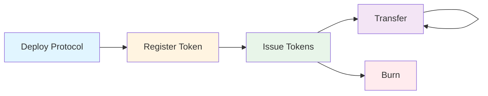
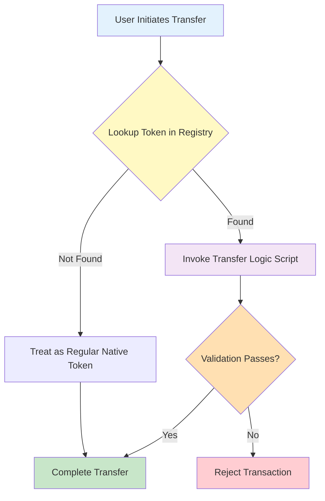

# Programmable Tokens - Aiken Implementation


**Smart contracts for CIP-113 programmable tokens on Cardano, written in Aiken.**

## Overview

This repository contains a complete Aiken implementation of CIP-113 programmable tokens — native Cardano assets enhanced with programmable transfer rules and lifecycle controls.

**CIP-113** is the overarching standard that defines the core framework: the shared custody model, on-chain registry, and validation coordination. The actual rules that specific programmable tokens must obey (e.g., denylist checks, freeze-and-seize) are defined in **substandards** — pluggable rule sets that operate within the CIP-113 framework. This repository includes the core standard implementation along with example substandards.

## What Are Programmable Tokens?

Programmable tokens are **native Cardano assets** with an additional layer of validation logic that executes on every transfer, mint, or burn operation. They leverage Cardano's existing native token infrastructure and require no hard fork or ledger changes — all programmable logic is implemented using features already supported at the L1 level. However, because all programmable tokens are held at a shared script address (with ownership determined by stake credentials), existing wallets, explorers, and DEXes would require integration work to fully support them — for example, wallets need to resolve stake-credential-based ownership to display balances, and DEX contracts would need to account for the programmable logic validators.

**Key principle**: All programmable tokens are locked in a shared smart contract address. Ownership is determined by stake credentials, allowing standard wallets to manage them while enabling unified validation across the entire token ecosystem.

## Key Features

- 🔐 **Permissioned Transfers** - Enforce custom validation rules on every token transfer
- 📋 **On-Chain Registry** - Decentralized directory of registered programmable tokens
- 🎯 **Composable Logic** - Plug-and-play transfer and minting validation scripts
- 🚫 **Freeze & Seize** - Optional issuer controls for regulatory compliance
- ⚡ **Constant-Time Lookups** - Sorted linked list registry enables O(1) token verification
- 🔗 **Native Asset Based** - Built on Cardano's native token infrastructure with no hard fork required
- 🛡️ **Multi-Layer Security** - NFT authenticity, ownership proofs, and authorization checks
- 🧩 **Extensible** - Support for denylists, allowlists, time-locks, and custom policies

## Use Cases

- **Stablecoins** - Fiat-backed tokens with sanctions screening and freeze capabilities
- **Tokenized Securities** - Compliance with securities regulations and transfer restrictions
- **Regulated Assets** - Any token requiring KYC/AML compliance or jurisdictional controls
- **Custom Policies** - Extensible framework for any programmable token logic

## Quick Start

### Prerequisites

- [Aiken](https://aiken-lang.org/installation-instructions) v1.0.29 or higher
- [Cardano CLI](https://github.com/IntersectMBO/cardano-cli) (optional, for deployment)

### Build

```bash
cd src/programmable-tokens-onchain-aiken
aiken build
```

### Test

```bash
aiken check
```

All tests should pass:
```
    Summary 1 error(s), 89 passing (89) [89/89 checks passed]
```

## Project Structure

```
.
├── validators/          # Smart contract validators
│   ├── programmable_logic_global.ak    # Core transfer validation coordinator
│   ├── programmable_logic_base.ak      # Token custody (delegates to global)
│   ├── registry_mint.ak                # Registry sorted linked list management
│   ├── registry_spend.ak               # Registry node UTxO guard
│   ├── issuance_mint.ak                # Token minting/burning policy
│   ├── issuance_cbor_hex_mint.ak       # Issuance script template reference NFT
│   ├── protocol_params_mint.ak         # Protocol parameters NFT (one-shot)
│   ├── example_transfer_logic.ak       # Example: simple permissioned transfer
│   ├── blacklist_mint.ak               # Denylist sorted linked list management
│   └── blacklist_spend.ak              # Denylist node UTxO guard
├── lib/
│   ├── types.ak                        # Core data types
│   ├── utils.ak                        # Utility functions
│   └── linked_list.ak                  # Sorted linked list operations
└── documentation/                       # Documentation
```

## Documentation

📚 **Documentation is available in the [`docs/`](./documentation/) directory:**

- **[Introduction](./documentation/01-INTRODUCTION.md)** - Problem statement, concepts, and benefits
- **[Architecture](./documentation/02-ARCHITECTURE.md)** - System design, validator coordination, on-chain data structures, and validation flows


## Core Components

The system is split into two layers: the **core standard** (CIP-113 framework) and **substandards** (pluggable token-specific rules).

### Core Standard (CIP-113 Framework)

These components form the shared infrastructure that all programmable tokens use:

#### 1. Token Registry (On-Chain Directory)

A sorted linked list of registered programmable tokens, implemented as on-chain UTxOs with NFT markers. Each registry entry contains the token policy ID, transfer validation script reference, issuer control script reference, and optional global state reference. The sorted structure enables O(1) membership and non-membership proofs via covering nodes.

#### 2. Programmable Logic Base + Global Validator

A shared spending validator (`programmable_logic_base`) holds all programmable tokens. It delegates all validation to the `programmable_logic_global` stake validator via the withdraw-zero pattern — the base runs per-input but the global runs once per-transaction, keeping costs constant regardless of input count.

#### 3. Minting Policies

- **Issuance Policy** (`issuance_mint`) — Parameterized per token type, handles minting/burning
- **Registry Policy** (`registry_mint`) — Manages the sorted linked list of registered tokens
- **Protocol Params Policy** (`protocol_params_mint`) — One-shot mint for global protocol parameters

### Substandards (Pluggable Token Rules)

Substandards define the actual rules that specific programmable tokens must obey. They are stake validators invoked via 0-ADA withdrawals, registered in the on-chain registry, and executed by the core framework on every transfer. Different tokens can use different substandards depending on their compliance requirements.

This repository includes example substandards:

#### Simple Permissioned Transfer
- **Transfer Logic** (`example_transfer_logic`) — Requires a specific credential to authorize transfers

#### Freeze and Seize (Regulated Stablecoin)
- **Transfer Logic** (`freeze_and_seize_transfer`) — Denylist-aware transfer logic that checks sender/recipient against an on-chain denylist
- **Third-Party Logic** — Controls seizure and freeze operations by authorized parties
- **Denylist Policy** (`blacklist_mint`) — Manages the sorted linked list of denylisted credentials
- **Denylist Guard** (`blacklist_spend`) — Guards denylist node UTxOs

### Validator Reference

**Core Standard (CIP-113 Framework)**

| Validator | Type | Purpose |
|-----------|------|---------|
| `programmable_logic_base` | Spend | Custody of all programmable token UTxOs; delegates to global validator |
| `programmable_logic_global` | Stake (withdraw) | Core coordinator: registry lookups, transfer logic invocation, value preservation |
| `protocol_params_mint` | Mint | One-shot mint of protocol parameters NFT |
| `registry_mint` | Mint | Sorted linked list management for registered token policies |
| `registry_spend` | Spend | Guards registry node UTxOs |
| `issuance_mint` | Mint | Mints/burns programmable tokens (parameterized per token type) |
| `issuance_cbor_hex_mint` | Mint | One-shot mint of issuance script template reference NFT |

**Example Substandards**

| Validator | Type | Purpose |
|-----------|------|---------|
| `example_transfer_logic` | Stake (withdraw) | Simple transfer logic: requires a specific credential |
| `freeze_and_seize_transfer` | Stake (withdraw) | Denylist-aware transfer logic for regulated tokens |
| `blacklist_mint` | Mint | Sorted linked list management for denylisted credentials |
| `blacklist_spend` | Spend | Guards denylist node UTxOs |

See the [Architecture doc](./documentation/02-ARCHITECTURE.md) for detailed validator interactions and validation flows.

## Transaction Lifecycle



1. **Deployment** - One-time setup of registry and protocol parameters
2. **Registration** - Register transfer logic and mint policy in registry
3. **Issuance** - Mint tokens with registered validation rules
4. **Transfer** - Transfer tokens with automatic validation
5. **Burn** - Burn tokens (requires issuer authorization)

## How It Works



All programmable tokens are locked at a shared smart contract address. When a transfer occurs:

1. Transaction spends token UTxO from programmable logic address
2. Global validator looks up token in on-chain registry
3. If registered, corresponding transfer logic script executes
4. Transfer succeeds only if all validation passes
5. Tokens return to programmable logic address with new stake credential

## Example: Freeze & Seize Stablecoin

This implementation includes a complete example of a regulated stablecoin with freeze and seize capabilities:

- **On-chain Denylist** - Sorted linked list of sanctioned addresses
- **Transfer Validation** - Every transfer checks sender/recipient not denylisted
- **Constant-Time Checks** - O(1) verification using covering node proofs
- **Issuer Controls** - Authorized parties can freeze/seize tokens

See [`validators/example_transfer_logic.ak`](./validators/example_transfer_logic.ak) for the implementation.

## Standards

This implementation is based on the foundational [CIP-143 (Interoperable Programmable Tokens)](https://cips.cardano.org/cip/CIP-0143) architecture and has been adapted for [CIP-113](https://github.com/cardano-foundation/CIPs/pull/444), which supersedes CIP-143 as a more comprehensive standard for programmable tokens on Cardano.

**Note**: CIP-113 is currently under active development. This implementation reflects the current understanding of the standard and may require updates as CIP-113 evolves.

## Development Status

**Current Status**: Research & Development

This is high-quality research and development code with the following characteristics:

- ✅ All core validators implemented with strong code quality
- ✅ Registry (directory) operations complete
- ✅ Token issuance and transfer flows working
- ✅ Freeze & seize functionality complete
- ✅ Denylist system operational
- ✅ Good test coverage (89 passing tests)
- ✅ Tested on Preview testnet (limited scope)
- ⏳ Comprehensive testing required
- ⏳ Professional security audit pending

**Security features implemented:**
- ✅ NFT-based registry authenticity
- ✅ Ownership verification via stake credentials
- ✅ Multi-layer authorization checks
- ✅ One-shot minting policies for protocol components
- ✅ Immutable validation rules post-registration
- ✅ DDOS prevention mechanisms

## Security Considerations

⚠️ **Important**: This code has **not been professionally audited** and has only been briefly tested on Preview testnet. While code quality is high, it is **not production-ready**. Do not use with real assets or in production environments without:
- Comprehensive security audit by qualified professionals
- Extensive testing across multiple scenarios
- Thorough review by domain experts

## Migration from Plutarch

This is a complete Aiken rewrite of the original Plutarch implementation ([wsc-poc](https://github.com/input-output-hk/wsc-poc)) by Phil DiSarro and the IOG team.

**What changed:**
- All validators rewritten in Aiken (from Plutarch/Haskell) with equivalent on-chain logic
- Added explicit stake credential checks on minting outputs (`issuance_mint`) to prevent permanent token locking — the original did not enforce this
- Multi-UTxO seizure support (`ThirdPartyAct`) ported from Plutarch PR #99
- Aiken's `Dict`/`Pairs` types replace Plutarch's `PMap` — keys are lexicographically sorted by default, which matches the registry's sorted-list requirement

**Performance:** Comparable to Plutarch. The withdraw-zero pattern means the expensive global validator runs once per transaction regardless of language. Individual validator execution units are within ~10% of the Plutarch equivalents.

**Not migrated:** The original Plutarch repo included off-chain transaction building in Haskell. This project uses a separate Java/Spring Boot backend and a Next.js/Mesh SDK frontend instead.

## Contributing

Contributions welcome! Please:

1. Read the [documentation](./documentation/) to understand the architecture
2. Ensure all tests pass (`aiken check`)
3. Add tests for new functionality
4. Follow existing code style and patterns
5. Open an issue to discuss major changes

## Testing

Run the complete test suite:

```bash
# Run all tests
aiken check

# Run specific test file
aiken check -m validators/programmable_logic_global

# Watch mode for development
aiken check --watch
```

## Related Components

- **Off-chain (Java)**: [`programmable-tokens-offchain-java/`](../programmable-tokens-offchain-java/) - Transaction building and blockchain integration

## Resources

- 📖 [Aiken Language Documentation](https://aiken-lang.org/)
- 🎓 [CIP-143 Specification](https://cips.cardano.org/cip/CIP-0143) - Original standard
- 🔄 [CIP-113 Pull Request](https://github.com/cardano-foundation/CIPs/pull/444) - Current standard development
- 🔗 [Cardano Developer Portal](https://developers.cardano.org/)
- 💬 [Aiken Discord](https://discord.gg/Vc3x8N9nz2)

## License

This project is licensed under the Apache License 2.0 - see the [LICENSE](../../LICENSE) file for details.

Copyright 2024 Cardano Foundation

## Acknowledgments

This implementation is migrated from the original Plutarch implementation developed by **Phil DiSarro** and the **IOG Team** (see [wsc-poc](https://github.com/input-output-hk/wsc-poc)). We are grateful for their foundational work on CIP-143.

Special thanks to:
- **Phil DiSarro** and the **IOG Team** for the original Plutarch design and implementation
- The **Aiken team** for the excellent smart contract language and tooling
- The **CIP-143/CIP-113 authors and contributors** for standard development
- The **Cardano developer community** for continued support and collaboration

---

**Built with ❤️ using [Aiken](https://aiken-lang.org/)**
