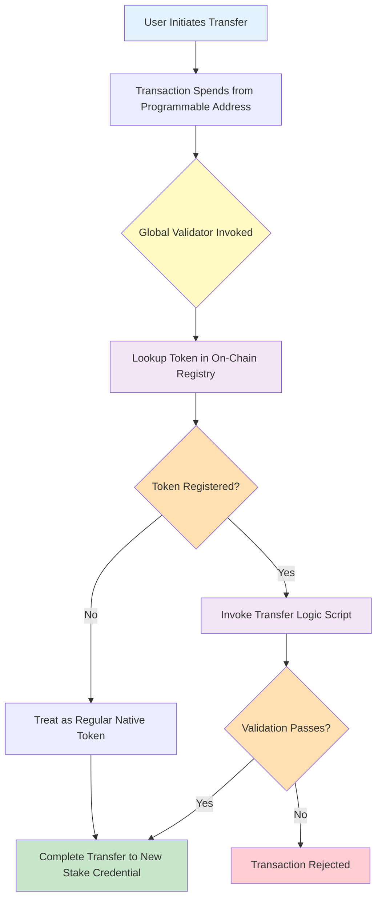

# Introduction to Programmable Tokens

**Programmable Tokens** are native Cardano assets enhanced with programmable lifecycle controls and transfer rules. They enable real-world assets like stablecoins and tokenized securities to operate on-chain while maintaining regulatory compliance.

---

## Table of Contents

1. [The Problem](#the-problem)
2. [What Are Programmable Tokens?](#what-are-programmable-tokens)
3. [How They Work (High-Level)](#how-they-work-high-level)
4. [Key Benefits](#key-benefits)
5. [CIP-143 Standard](#cip-143-standard)
6. [Next Steps](#next-steps)

---

## The Problem

### Blockchain Tokens Lack Transfer Restrictions

Traditional blockchain tokens, including Cardano's native assets, are **permissionless by design**. Anyone can transfer tokens to anyone else without restriction. While this property is fundamental to decentralized systems, it creates significant challenges for regulated assets:

- **Stablecoins** need to comply with sanctions lists and anti-money laundering (AML) requirements
- **Tokenized securities** must enforce transfer restrictions based on jurisdiction and investor accreditation
- **Real-world assets** require mechanisms for freeze-and-seize in response to court orders or regulatory actions
- **Institutional assets** need compliance with securities regulations and KYC/AML frameworks

### The Gap Between Blockchain and Regulated Finance

Financial institutions and asset issuers cannot simply deploy tokens on blockchain without addressing compliance requirements. The gap between permissionless blockchain infrastructure and regulated finance has limited institutional adoption of tokenization.

**Existing approaches have limitations:**
- **Centralized custodians** - Reintroduce intermediaries and counterparty risk
- **Off-chain enforcement** - Cannot prevent unauthorized transfers at protocol level
- **Smart contract wrappers** - Break compatibility with standard wallets and infrastructure
- **Separate blockchains** - Fragment liquidity and interoperability

**What's needed**: A solution that adds programmable constraints to native tokens while preserving compatibility with existing Cardano infrastructure.

---

## What Are Programmable Tokens?

### Definition

**Programmable tokens are native Cardano assets with an additional layer of validation logic that executes on every transfer, mint, or burn operation.**

They leverage Cardano's existing native token infrastructure and require no hard fork or ledger changes. However, because tokens are held at a shared script address with stake-credential-based ownership, wallets, explorers, and DEXes would require integration work to fully support them.

### Key Principle

All programmable tokens are locked in a **shared smart contract address**. Ownership is determined by **stake credentials**, allowing standard wallets to manage them while enabling unified validation across the entire token ecosystem.

This approach means:
- Payment credential is **shared** across all token holders (the programmable logic base address)
- Stake credential is **unique** per holder (determines ownership)
- Wallets could manage tokens if they resolve stake-credential-based ownership
- Every transfer automatically invokes validation logic

### Still Native Assets

**Important**: Programmable tokens are NOT a separate token standard or blockchain fork. They are **Cardano native assets** enhanced with lifecycle rules. Their minting policies, transfer rules, and burning operations are governed by additional smart contract logic, but they remain native tokens at the ledger level.

### Comparison: Native vs Programmable Tokens

| Aspect | Native Token | Programmable Token |
|--------|-------------|-------------------|
| **Asset Type** | Cardano native asset | Cardano native asset (enhanced) |
| **Transfer Rules** | Unrestricted | Programmable validation |
| **Custody** | Any address | Programmable logic address |
| **Ownership** | Payment credential | Stake credential |
| **Validation** | Ledger rules only | Ledger + custom logic |
| **Wallet Support** | Standard wallets | Requires integration* |
| **Explorer Support** | All explorers | Requires integration* |
| **DEX Compatibility** | Full | Requires integration* |

**\* Note**: Programmable tokens are native assets at the ledger level, but because they are held at a shared script address with ownership determined by stake credentials, wallets need to resolve stake-credential-based ownership to display balances, explorers need to attribute tokens to holders rather than the script address, and DEX contracts need to interact with the programmable logic validators. No hard fork or ledger changes are required — all programmable logic uses features already supported at the L1 level.

### Example Use Cases

**Regulated Stablecoins**:
- Denylist sanctioned addresses
- Freeze accounts pending investigation
- Seize tokens in response to court orders
- Maintain compliance with FATF travel rule

**Tokenized Securities**:
- Enforce investor accreditation requirements
- Restrict transfers by jurisdiction
- Implement lock-up periods
- Comply with securities regulations

**Real-World Assets**:
- Programmable vesting schedules
- Time-locked transfers
- Allowlist-only trading
- Custom compliance logic

---

## How They Work (High-Level)

Programmable tokens use a multi-layered architecture with on-chain registries, shared custody addresses, and pluggable validation scripts.

### Architecture Overview



### Key Components

#### 1. Programmable Logic Address
All programmable tokens are held at a shared smart contract address. This address has:
- **Payment credential**: Shared across all token holders (the smart contract)
- **Stake credential**: Unique per holder (determines ownership)

When you transfer tokens, you're changing the stake credential while keeping the same payment credential.

#### 2. On-Chain Registry (Directory)
A sorted linked list of registered programmable tokens, stored as on-chain UTxOs. Each registry entry contains:
- Token policy ID
- Transfer validation script reference
- Issuer control script reference
- Optional global state reference (e.g., denylist)

The linked list structure enables **O(1) verification** - you can prove a token is registered (or not registered) with constant-time lookups.

#### 3. Validation Scripts
Pluggable stake validators that define custom logic:
- **Transfer Logic**: Runs on every token transfer (e.g., denylist checks, allowlist validation)
- **Issuer Logic**: Controls minting, burning, and seizure operations

Scripts are invoked using the **withdraw-zero pattern** - stake validators are triggered with 0 ADA withdrawals.

#### 4. Global Validator
The core CIP-143 validator that coordinates all operations:
1. Identifies programmable tokens in the transaction
2. Looks up each token in the on-chain registry
3. Invokes corresponding transfer logic scripts
4. Validates ownership via stake credentials
5. Ensures tokens return to programmable logic address

### Transaction Flow Example

Let's walk through a simple transfer:

1. **Alice wants to send 100 USDC tokens to Bob**
   - Alice's tokens are at: `addr1...programmable_logic_base` + `stake1...alice`
   - Bob will receive at: `addr1...programmable_logic_base` + `stake1...bob`

2. **Transaction is built**:
   - Input: Alice's UTxO (100 USDC)
   - Output: New UTxO with Bob's stake credential (100 USDC)
   - Signature: Alice signs with her stake key

3. **Validation executes**:
   - Global validator checks Alice's signature ✓
   - Registry lookup finds USDC is registered ✓
   - Transfer logic script runs (e.g., checks denylist) ✓
   - Tokens go to programmable address with Bob's stake credential ✓

4. **Result**: Bob now owns the tokens at the shared address with his stake credential.

### Security Model

**Ownership Verification**:
- Every input from the programmable logic address must be authorized
- Authorization = signature from stake key OR script invocation
- If ANY input lacks authorization, transaction fails

**Registry Authenticity**:
- Registry entries are marked with NFTs from a one-shot minting policy
- Prevents forged registry entries
- Ensures only legitimate tokens can be validated

**Immutability**:
- Once registered, validation rules cannot change
- Provides predictability for token holders
- Issuer controls are explicitly defined at registration time

---

## Key Benefits

### For Asset Issuers

**Automated Compliance**:
- Transfer restrictions enforced at protocol level
- No need for off-chain monitoring systems
- Reduced operational overhead and compliance costs

**Flexible Controls**:
- Freeze/seize capabilities for regulatory compliance
- Custom validation logic for specific use cases
- Composable with other smart contracts

**Institutional Grade**:
- Predictable behavior (code is law)
- Transparent rules visible on-chain
- Auditable transaction history

### For Token Holders

**Native Asset Foundation**:
- Built on Cardano's native token infrastructure, no hard fork required
- Wallets and explorers can support them with stake-credential-aware integration
- Tokens remain native assets at the ledger level

**Transparent Rules**:
- Validation logic is public and immutable
- Users know exactly what restrictions apply
- No hidden centralized controls (beyond those explicitly coded)

**Native Asset Benefits**:
- First-class ledger support
- Low transaction fees
- High throughput

### For the Cardano Ecosystem

**Interoperability**:
- Standard interface (CIP-143) enables ecosystem integration
- DeFi protocols can support programmable tokens
- Bridges and oracles can integrate easily

**Composability**:
- Programmable tokens work with other smart contracts
- Can be used in DEXes, lending protocols, DAOs
- Enables complex DeFi primitives

**Institutional Adoption**:
- Lowers barriers for regulated asset issuance
- Attracts traditional finance institutions
- Expands Cardano's use cases

---

## CIP-143 Standard

This implementation is based on **[CIP-143 (Interoperable Programmable Tokens)](https://github.com/cardano-foundation/CIPs/tree/master/CIP-0143)**, which defines a standard for programmable token lifecycle management on Cardano.

### Standards Compliance

Programmable tokens enable compliance with various regulatory frameworks including stablecoin standards and tokenized securities requirements. The architecture supports implementation of controls required by financial regulations while maintaining the decentralized nature of Cardano.

### Relationship to CIP-113

CIP-143 has been incorporated into the newer **[CIP-113](https://github.com/HarmonicLabs/CIPs/tree/master/CIP-0113)** proposal. This implementation follows CIP-143 and includes features useful for regulated tokens.

### Implementation Status

**Current Status**: Research & Development

- ✅ All core validators implemented with high code quality
- ✅ Registry operations complete
- ✅ Token issuance and transfer flows working
- ✅ Freeze & seize functionality operational
- ✅ Good test coverage (89 passing tests)
- ✅ Tested on Preview testnet (limited scope)
- ⏳ Comprehensive testing and audit pending

⚠️ **Important**: This is research and development code. It has **not been professionally audited** and has only been briefly tested on Preview testnet. While the code quality is high, it is not production-ready. A comprehensive security audit and extensive testing are required before any mainnet deployment or use with real assets.

---

## Next Steps

Now that you understand what programmable tokens are and why they exist, you can dive deeper:

### Learn More

- **[Architecture](./02-ARCHITECTURE.md)** - System design, validator coordination, on-chain data structures, and validation flows

### Try It Out

```bash
cd src/programmable-tokens-onchain-aiken
aiken build
aiken check
```

### Additional Resources

- 📖 [Main README](../README.md) - Project overview and quick start
- 🏛️ [Architecture Deep-Dive](./02-ARCHITECTURE.md) - Validator coordination, data structures, and validation flows
- 🔄 [CIP-143 Flow Documentation](../../../CIP-0143-FLOW.md) - Complete transaction flows

---

**Questions or feedback?** Open an issue in the repository or check the [Aiken Discord](https://discord.gg/Vc3x8N9nz2) for community support.
