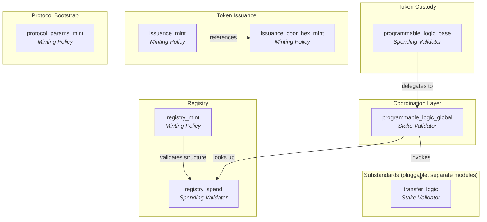
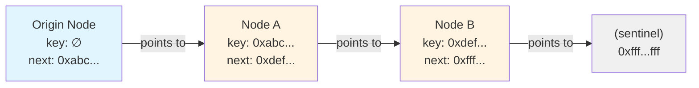
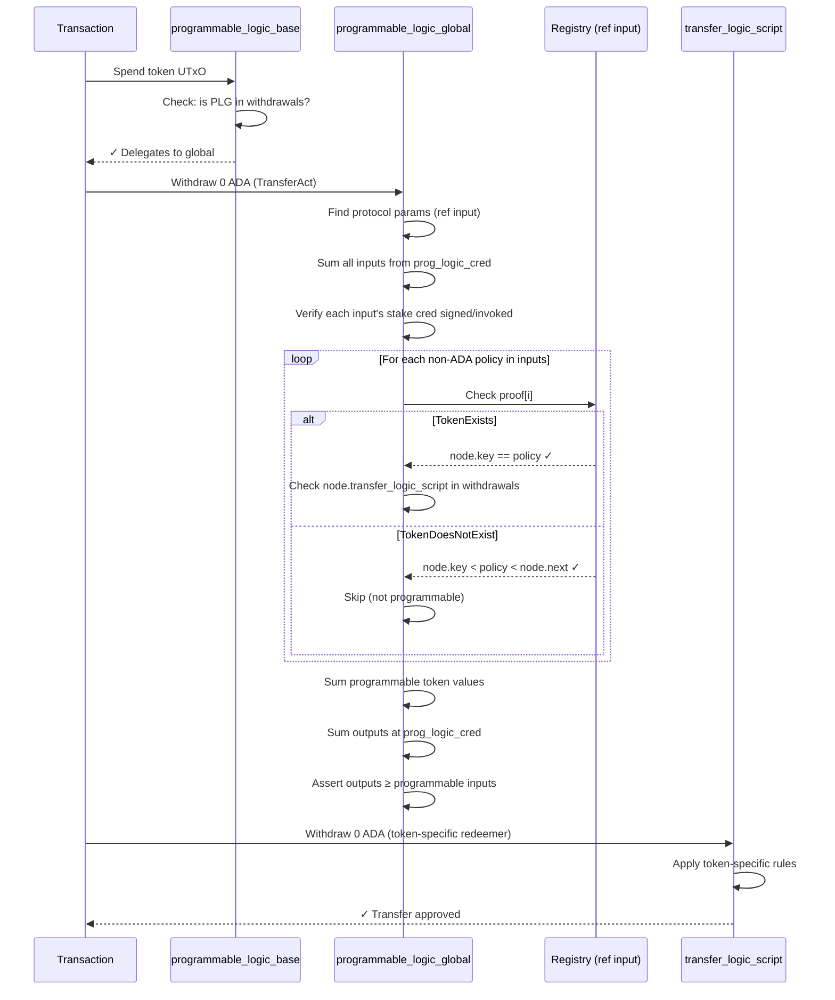

# Architecture Deep-Dive

This document explains the on-chain architecture of the CIP-113 programmable tokens implementation in Aiken. It covers the ownership model, validator coordination, on-chain data structures, and step-by-step validation flows.

---

## Table of Contents

1. [Ownership Model](#ownership-model)
2. [Validator Architecture](#validator-architecture)
3. [Withdraw-Zero Pattern](#withdraw-zero-pattern)
4. [On-Chain Registry](#on-chain-registry)
5. [Denylist System](#denylist-system)
6. [Data Structures](#data-structures)
7. [Validation Flows](#validation-flows)
8. [Security Properties](#security-properties)

---

## Ownership Model

### Shared Payment Credential + Unique Stake Credentials

The fundamental design insight is that Cardano addresses are composed of two parts: a **payment credential** and a **stake credential**. Programmable tokens exploit this by using a single shared payment credential (the `programmable_logic_base` script hash) while assigning unique stake credentials to individual holders.

```
Cardano Address = Payment Credential + Stake Credential
                  ─────────────────   ────────────────
                  Shared across ALL    Unique per holder
                  programmable tokens  (determines ownership)
```

This means:

- **All programmable tokens live at addresses that share the same payment credential** — the `programmable_logic_base` validator hash. This is what enables unified validation: every spend from this payment credential triggers the same spending validator.
- **Ownership is determined by the stake credential** — either a verification key (for wallet holders) or a script hash (for smart contract-controlled holdings).
- **Wallets require integration** — tokens are native assets at the ledger level, but wallets need to resolve stake-credential-based ownership at the shared script address to display balances correctly.

### Transferring Tokens

A transfer changes the stake credential while keeping the payment credential constant:

```
Before:  addr(programmable_logic_base, stake_alice) → 100 USDC
After:   addr(programmable_logic_base, stake_bob)   → 100 USDC
```

The `programmable_logic_base` payment credential is the same in both cases. What changes is who "owns" the UTxO — determined by the stake credential.

---

## Validator Architecture

The system uses a layered architecture where lightweight validators delegate to a central coordinator.



The diagram above shows the **core CIP-113 standard** (Token Custody, Coordination Layer, Registry, Token Issuance, Protocol Bootstrap) and indicates where **substandards** plug in. The core standard is deployed once and shared by all programmable tokens. Substandards are pluggable — different tokens can register different transfer logic and supporting validators depending on their compliance requirements, without modifying the core framework. See the [`substandards/`](../../../substandards/) directory for implementations (dummy, freeze-and-seize).

### Validator Reference

**Core Standard (CIP-113 Framework)**

| Validator | Type | Parameters | Purpose |
|-----------|------|------------|---------|
| `programmable_logic_base` | Spend | `stake_cred` | Custody of all programmable token UTxOs. Delegates to global validator. |
| `programmable_logic_global` | Stake (withdraw) | `protocol_params_cs` | Core coordinator. Validates transfers, checks registry, invokes transfer logic. |
| `protocol_params_mint` | Mint | `utxo_ref` | One-shot mint of the protocol parameters NFT. |
| `registry_mint` | Mint | `utxo_ref`, `issuance_cbor_hex_cs` | Manages the sorted linked list of registered token policies. |
| `registry_spend` | Spend | `protocol_params_cs` | Guards registry node UTxOs; only allows spending when `registry_mint` is active. |
| `issuance_mint` | Mint | `programmable_logic_base`, `minting_logic_cred` | Mints/burns programmable tokens. Parameterized per token type. |
| `issuance_cbor_hex_mint` | Mint | `utxo_ref` | One-shot mint of the reference NFT holding issuance script template bytes. |

Substandard validators (transfer logic, denylist management, etc.) live in the [`substandards/`](../../../substandards/) directory as separate Aiken modules.

### Dual Validator Delegation

The `programmable_logic_base` validator is intentionally minimal. Its only job is to verify that the `programmable_logic_global` stake validator is present in the transaction's withdrawals:

```aiken
// programmable_logic_base.ak — the entire spend logic
validator programmable_logic_base(stake_cred: Credential) {
  spend(_datum, _redeemer, _own_ref, self: Transaction) {
    list.any(self.withdrawals, fn(wdrl) {
      let Pair(cred, _amount) = wdrl
      cred == stake_cred
    })
  }
}
```

This pattern is critical for performance: spending validators run once *per input*, but stake validators (via withdrawals) run only once *per transaction*. Since the global validator contains the expensive registry lookups and transfer logic invocations, running it once instead of N times (for N inputs) saves significant execution units.

---

## Withdraw-Zero Pattern

The **withdraw-zero pattern** is the mechanism that invokes stake validators without actual staking activity. A transaction includes a withdrawal of 0 ADA from a script's reward address, which forces the ledger to execute that script's `withdraw` handler.

### How It Works

1. The transaction includes `withdrawals: [(script_credential, 0)]`
2. The Cardano ledger sees a withdrawal from a script address and runs the validator
3. The validator's `withdraw` handler executes with access to the full transaction context
4. The 0 ADA withdrawal has no economic effect — it's purely a trigger mechanism

### Why It Matters

This pattern enables three critical capabilities:

1. **Single execution for multiple inputs** — The global validator runs once per transaction, not once per UTxO input. This is essential for multi-input transfers.
2. **Composable validation** — Multiple stake validators can be invoked in the same transaction (global + transfer logic + issuer logic), each checking different aspects.
3. **Pluggable logic** — Transfer logic scripts are registered in the on-chain registry as stake credentials. Any new transfer logic can be deployed without modifying the core validators.

### In Practice

A transfer transaction includes these withdrawals:

```
withdrawals:
  - (programmable_logic_global, 0 ADA)    # Core validation
  - (transfer_logic_script,     0 ADA)    # Token-specific rules
```

The global validator checks that the appropriate transfer logic script is also in the withdrawal list (i.e., it has been invoked). This creates a chain of validation: base → global → transfer logic.

---

## On-Chain Registry

The registry is a **sorted linked list** of registered programmable token policies, stored as UTxOs on-chain. Each node is a UTxO containing an NFT marker and an inline datum.

### Structure



Each node is a UTxO with:
- **An NFT** from `registry_mint` policy (token name = `key`, or empty string for origin)
- **An inline datum** of type `RegistryNode` containing the policy key, next pointer, and script references

### O(1) Membership Proofs

The sorted linked list enables constant-time membership and non-membership proofs:

**Token exists** (`TokenExists { node_idx }`): The proof points to a registry node where `node.key == token_policy_id`. The validator checks:
1. The node has an authentic NFT from `registry_node_cs`
2. `node.key == currency_symbol`
3. `node.transfer_logic_script` is in the transaction's withdrawals

**Token does not exist** (`TokenDoesNotExist { node_idx }`): The proof points to a "covering node" where `node.key < token_policy_id < node.next`. Since the list is sorted and complete, this proves no node with that key exists.

```
Covering node proof:

  node.key = 0xabc...    (less than target)
  target   = 0xbcd...    (the policy we're looking up)
  node.next = 0xdef...   (greater than target)

  → 0xbcd... is NOT in the registry
```

This is how the global validator handles non-programmable tokens in the same transaction — it doesn't reject them; it simply skips validation for tokens proven not to be in the registry.

### Insertion

Inserting a new token into the registry (`RegistryInsert`):

1. Find the covering node where `covering.key < new_key < covering.next`
2. Spend the covering node UTxO
3. Create two output UTxOs:
   - **Updated covering node**: `key` unchanged, `next` → `new_key`
   - **New node**: `key` = `new_key`, `next` = old `covering.next`
4. Mint one NFT with token name = `new_key`
5. Validate that `new_key` is a legitimate programmable token (via `IssuanceCborHex` template matching)

```
Before:  [covering: key=A, next=C]
After:   [covering: key=A, next=B]  [new: key=B, next=C]
```

---

## Denylist System

> **Note:** The denylist is part of the [freeze-and-seize substandard](../../../substandards/freeze-and-seize/), not the core CIP-113 framework. It is documented here because it illustrates how substandards extend the core architecture.

The denylist uses the same sorted linked list pattern as the registry, but for credential hashes instead of policy IDs.

### Structure

Each `BlacklistNode` contains:
- `key`: The denylisted credential hash (28 bytes)
- `next`: The next credential hash in sorted order

### Operations

| Operation | Description | Authorization |
|-----------|-------------|--------------|
| `BlacklistInit` | Create origin node | One-shot (UTxO consumed) |
| `BlacklistInsert` | Add credential to denylist | Manager signature required |
| `BlacklistRemove` | Remove credential from denylist | Manager signature required |

### Non-Membership Proofs in Transfers

During a transfer, the `freeze_and_seize_transfer` validator:

1. Extracts all stake credential hashes from programmable token inputs
2. For each credential, requires a `NonmembershipProof { node_idx }` pointing to a covering node
3. Validates `node.key < credential_hash < node.next` for each proof
4. If any credential IS denylisted (no valid covering node exists), the transaction fails

This means every transfer of a denylist-protected token requires O(n) proofs where n is the number of unique stake credentials in the transaction inputs — but each individual proof is O(1).

---

## Data Structures

### RegistryNode

```aiken
type RegistryNode {
  key: ByteArray,                              // Policy ID of the registered token
  next: ByteArray,                             // Next key in sorted order
  transfer_logic_script: Credential,           // Stake validator for transfer rules
  third_party_transfer_logic_script: Credential, // Stake validator for seizure/freeze
  global_state_cs: ByteArray,                  // Optional NFT for global state (e.g., denylist)
}
```

### BlacklistNode (freeze-and-seize substandard)

```aiken
type BlacklistNode {
  key: ByteArray,   // Denylisted credential hash
  next: ByteArray,  // Next key in sorted order
}
```

### ProgrammableLogicGlobalParams

Stored on-chain in a UTxO marked by the protocol params NFT:

```aiken
type ProgrammableLogicGlobalParams {
  registry_node_cs: PolicyId,  // Currency symbol of registry NFTs
  prog_logic_cred: Credential, // Payment credential of programmable_logic_base
}
```

### Redeemers

**Global validator** (`ProgrammableLogicGlobalRedeemer`):

```aiken
type ProgrammableLogicGlobalRedeemer {
  // Normal transfer: one proof per non-ADA policy in the inputs
  TransferAct { proofs: List<RegistryProof> }
  // Admin action (seize): operates on specific input/output indices
  ThirdPartyAct {
    registry_node_idx: Int,
    input_idxs: List<Int>,
    outputs_start_idx: Int,
    length_input_idxs: Int,
  }
}
```

**Registry proofs** (`RegistryProof`):

```aiken
type RegistryProof {
  TokenExists { node_idx: Int }        // Points to the matching registry node
  TokenDoesNotExist { node_idx: Int }  // Points to the covering node
}
```

**Denylist proofs** (`BlacklistProof`, freeze-and-seize substandard):

```aiken
type BlacklistProof {
  NonmembershipProof { node_idx: Int } // Points to the covering node
}
```

### IssuanceCborHex

Used during registration to verify that a policy ID was generated from the correct issuance script template:

```aiken
type IssuanceCborHex {
  prefix_cbor_hex: ByteArray,   // Prefix of the minting policy script
  postfix_cbor_hex: ByteArray,  // Postfix of the minting policy script
}
```

The registration validator reconstructs the script as `version_header ++ prefix ++ hashed_param ++ postfix`, hashes it with blake2b_224, and checks the result matches the policy ID being registered.

---

## Validation Flows

### Transfer Flow (Step by Step)



Key invariant: the total programmable token value in outputs at the `prog_logic_cred` address must be **at least** the total programmable token value from signed inputs. This prevents tokens from "escaping" the programmable logic address.

### Third-Party (Seize) Flow

The `ThirdPartyAct` redeemer handles admin operations like token seizure. It differs from transfers:

1. **No ownership check** — the `third_party_transfer_logic_script` authorizes the action instead of the stake credential owner
2. **Token removal** — seized tokens are removed from the victim's UTxO (output value = input value minus seized policy)
3. **Strict input-output mapping** — each input at `input_idxs[i]` maps to an output at `outputs_start_idx + i`
4. **Same address/datum** — the output must preserve the victim's address and datum, only removing the seized tokens
5. **Anti-DDOS** — the input and output values must actually differ (prevents no-op seizures)

### Token Registration Flow

1. Build a transaction that mints tokens with the new policy **and** inserts a registry node
2. The `registry_mint` validator:
   - Finds the `IssuanceCborHex` reference input (template bytes)
   - Verifies `blake2b_224(version_header ++ prefix ++ hashed_param ++ postfix) == new_policy_id`
   - Verifies the covering node covers the insertion point
   - Validates the two output nodes maintain sorted order
3. The `registry_spend` validator allows spending the covering node because `registry_mint` is active

---

## Security Properties

### NFT Authenticity
Every registry and denylist node is marked with an NFT from a one-shot minting policy. Validators always check `has_currency_symbol(node.value, expected_cs)` before trusting any datum. This prevents forged registry entries.

### Ownership Enforcement
The global validator iterates over **all** inputs from `prog_logic_cred` and requires each one to be authorized by its stake credential (signature for verification keys, withdrawal invocation for scripts). If any input lacks authorization, the entire transaction fails.

### Value Preservation
During transfers, the global validator computes the total programmable token value from authorized inputs and verifies that outputs at `prog_logic_cred` contain **at least** that much value. Tokens cannot be moved to non-programmable addresses.

### Sorted List Integrity
Both registry and denylist maintain the invariant `node.key < node.next` for every node. Insertions verify the covering node covers the new key. This prevents duplicate entries and ensures covering-node proofs are always valid.

### One-Shot Policies
Protocol parameters, registry, denylist, and issuance CBOR hex NFTs use one-shot minting policies (parameterized by a UTxO reference). This guarantees exactly one instance of each can exist, preventing duplication attacks.

### Anti-DDOS in Seizures
The `ThirdPartyAct` handler explicitly checks that the input value differs from the expected output value (`input_dict != expected_output_dict`). This prevents adversaries from submitting no-op seizure transactions that waste on-chain resources.

---

**Next**: Return to the [README](../README.md) for build instructions, or see the [Introduction](./01-INTRODUCTION.md) for high-level concepts.
